# Relatório técnico: clima como base para estimar carbono e textura do solo no Brasil

**Repositório:** `MapBiomas_analises` (GitHub `fcoliveira-utfpr/climate_for_soil`)
**Período das análises:** setembro de 2026
**Escopo:** validação de bases climáticas, construção de classificações climáticas a partir do CHELSA V2.1,
comparação dessas classificações como base para estimar o estoque de carbono orgânico (SOC) e a textura
(areia, silte, argila) do solo em 0-30 cm, e teste dentro dos modelos do MapBiomas Solo (coleção 3).

---

## Sumário

1. [Visão geral e perguntas de pesquisa](#1-visão-geral-e-perguntas-de-pesquisa)
2. [Validação das bases climáticas contra estações](#2-validação-das-bases-climáticas-contra-estações)
3. [Pipeline do CHELSA e diagnóstico da normal de precipitação](#3-pipeline-do-chelsa-e-diagnóstico-da-normal-de-precipitação)
4. [Classificações climáticas a partir do CHELSA](#4-classificações-climáticas-a-partir-do-chelsa)
5. [Comparação das classificações como base para SOC e textura](#5-comparação-das-classificações-como-base-para-soc-e-textura)
6. [Experimento: o que colocar no lugar do Köppen nos modelos do MapBiomas](#6-experimento-o-que-colocar-no-lugar-do-köppen-nos-modelos-do-mapbiomas)
7. [Reprodução dos modelos do MapBiomas Solo C3](#7-reprodução-dos-modelos-do-mapbiomas-solo-c3)
8. [Síntese dos resultados](#8-síntese-dos-resultados)
9. [Limitações e próximos passos](#9-limitações-e-próximos-passos)
10. [Anexo: estrutura do repositório e reprodução](#10-anexo-estrutura-do-repositório-e-reprodução)

---

## 1. Visão geral e perguntas de pesquisa

O trabalho partiu de uma pergunta aplicada: **o MapBiomas Solo usa o Köppen (versão IPEF, Alvares et al. 2013)
como única informação climática dos seus modelos de SOC e textura. Existe uma representação do clima melhor
para essa finalidade?**

Para responder, o caminho foi dividido em etapas, cada uma motivada pelo que a anterior revelou:

| Etapa | Pergunta | Onde |
|---|---|---|
| Validação | Qual base climática em grade reproduz melhor as estações? | `validacao/` |
| Pipeline CHELSA | Como obter normais 1991-2020 confiáveis a ~1 km para o Brasil? | `climas/chelsa_climas_brasil/` |
| Classificações | Köppen, Holdridge e Thornthwaite corretos a partir do CHELSA | `climas/chelsa_climas_brasil/` |
| Comparação | Qual classificação, **sozinha**, separa melhor SOC e textura? | `corelacao/comparacao_climas.ipynb` |
| Experimento | O que colocar no lugar do Köppen **dentro** de um modelo com as covariáveis do MapBiomas? | `corelacao/experimento_clima_modelos.ipynb` |
| Reprodução | Repetir o teste **reproduzindo fielmente** os modelos do MapBiomas C3, com mapas | `climas/reproducao/` |

Os dados de solo são as matrizes de treino do MapBiomas Solo C3 no Google Earth Engine (acesso restrito) e,
no SOC da reprodução, os pontos da coleção 3 que alimentam a matriz de produção (seção 7.2).
Os dados por ponto nunca foram versionados; só resultados agregados vão para o git.

---

## 2. Validação das bases climáticas contra estações

**Objetivo.** Escolher a base climática em grade para as classificações, comparando-a com observações de
estações meteorológicas.

**Dados.**
- Observado: série mensal de **22 estações** meteorológicas em 13 UFs, de **2010 a 2019**
  (`mensal_todas_estacoes.csv`; poucas na Amazônia, uma em Rondônia e uma no Pará).
- Grades: **Xavier** (grade brasileira de estações interpoladas), **CHELSA V2.1** (~1 km) e **ERA5-Land**
  (~9 km, extraído do GEE por `baixar_era5.py`). Uma versão anterior usava TerraClimate; ele foi trocado
  pelo ERA5-Land, e a comparação foi refeita com os dados CHELSA atualizados (seção 3).
- Variáveis: temperatura média (`tmed`) e precipitação mensal (`pr_mes`). A ETP ficou fora do escopo, por
  não haver ETP observada comparável nas estações.

**Métricas.** Para cada par estação × mês: viés, PBIAS, MAE, RMSE, correlação de Pearson (r), NSE, índice de
concordância d de Willmott, KGE e razão de desvios-padrão. Métricas globais (todos os pares) e medianas por
estação.

**Resultados (métricas globais, ~2.390 pares estação × mês):**

| Variável | Base | r | RMSE | Viés | NSE | KGE |
|---|---|---|---|---|---|---|
| tmed | CHELSA | 0,990 | 0,82 °C | −0,50 °C | 0,967 | 0,977 |
| tmed | Xavier | 0,986 | 0,85 °C | +0,22 °C | 0,965 | 0,919 |
| tmed | ERA5-Land | 0,949 | 1,63 °C | −0,75 °C | 0,871 | 0,875 |
| pr_mes | Xavier | 0,922 | 44,0 mm | +5,0 mm | 0,846 | 0,903 |
| pr_mes | CHELSA | 0,815 | 66,9 mm | −1,4 mm | 0,644 | 0,810 |
| pr_mes | ERA5-Land | 0,815 | 66,2 mm | +2,0 mm | 0,650 | 0,803 |

**Leitura e decisão.**
- **Temperatura:** CHELSA e Xavier são equivalentes e muito bons; ERA5-Land fica atrás. A resolução mais
  grossa do ERA5-Land penaliza estações em relevo.
- **Precipitação:** Xavier é claramente a melhor. CHELSA e ERA5-Land empatam.

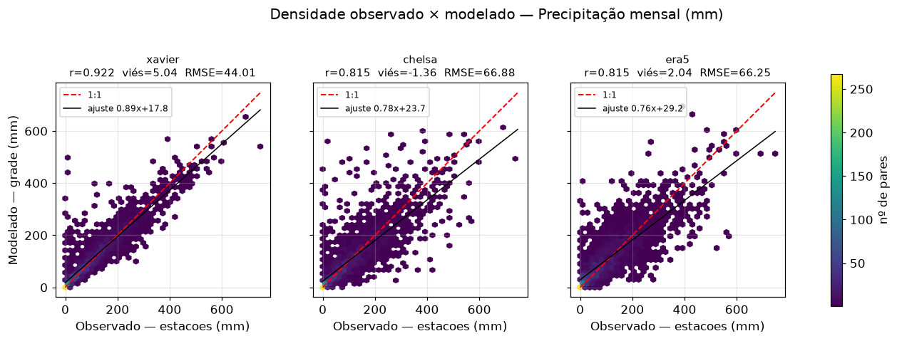
*Figura 1. Precipitação mensal observada nas estações × estimada por cada grade. Xavier segue a linha 1:1
bem mais de perto; CHELSA e ERA5-Land têm dispersão parecida.*

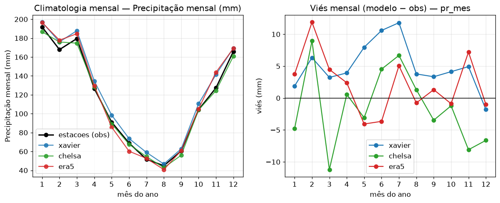
*Figura 2. Climatologia mensal da precipitação (média das estações) e viés de cada grade por mês. As três
reproduzem bem o ciclo; o CHELSA subestima um pouco no fim do verão (março) e no fim do ano.*

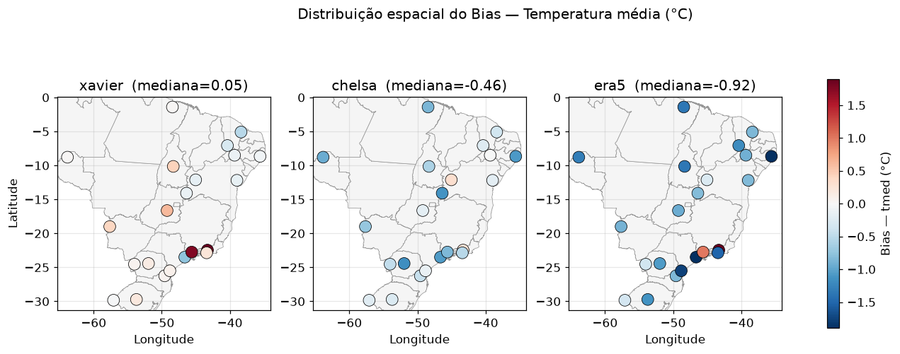
*Figura 3. Viés da temperatura média por estação. O CHELSA é levemente frio (mediana −0,46 °C) e o ERA5-Land
mais frio (−0,92 °C), sobretudo no Nordeste e no litoral.*

- **Decisão: CHELSA como base das classificações.** Mesmo perdendo para o Xavier em chuva, o CHELSA reúne o
  que as classificações exigem: resolução de ~1 km (necessária para zoneamento em relevo), temperatura tão
  boa quanto a do Xavier, **ETP de Penman-Monteith** pronta (necessária para Holdridge e Thornthwaite) e
  cobertura contínua, com o mesmo produto para todas as variáveis. Em chuva, fica empatado com o ERA5-Land.

---

## 3. Pipeline do CHELSA e diagnóstico da normal de precipitação

### 3.1 Construção das normais

- `baixar_recortar.py`: baixa os 360 GeoTIFFs mensais (1991-2020) de `tas`, `pr` e `pet` do CHELSA V2.1
  **lendo só a janela do Brasil** dos COGs remotos (`/vsicurl/`), sem baixar os arquivos globais. Aplica o
  nodata e a escala/offset embutidos em cada arquivo e converte `tas` para °C. Grava um manifesto
  (`manifesto_arquivos.csv`), porque a fonte tem meses faltantes de `pet`.
- `gerar_normal_multibanda.py`: calcula a média de cada mês ao longo de 1991-2020 (tolerante a anos
  faltantes) e grava **uma imagem de 12 bandas por variável**.
- Os três GeoTIFFs sobem ao GEE como assets separados
  (`projects/fcoliveira/assets/chelsa_brasil_{tas,pr,pet}_normal_1991_2020`).

### 3.2 Por que três assets separados: o diagnóstico da chuva

A primeira versão tinha **um único asset combinado**. Os indícios de problema na chuva motivaram um
diagnóstico dedicado (`diagnostico_chuva_CHELSA_1991_2020.ipynb`).

**Método.** A diferença entre duas normais mistura mudança climática real com erro de processamento. Para
separar os dois, usou-se uma razão dupla com referências independentes (CHIRPS e TerraClimate) calculadas
para os mesmos dois períodos:

$$DR = \frac{P^{CHELSA}_{91-20}/P^{CHELSA}_{81-10}}{P^{REF}_{91-20}/P^{REF}_{81-10}}$$

O viés próprio do CHELSA em relação à referência aparece nos dois períodos e se cancela; DR ≈ 1 indica
consistência. O diagnóstico também verificou saturação de tipo inteiro, fator de escala, ciclo sazonal pixel
a pixel, estatísticas por UF e o padrão espacial do DR.

**Resultado.**
- DR anual ≈ 0,92 no Brasil, mas com várias UFs do Sul, Sudeste e Centro-Oeste fora do limiar, e ciclo
  sazonal pouco correlacionado com o CHIRPS (r = 0,925).
- **Verificação independente:** a normal foi reconstruída localmente a partir dos dados brutos, com os mesmos
  scripts do repositório. A reconstrução acompanha o CHIRPS quase perfeitamente (r = 0,998 no ciclo sazonal).
- Comparando o asset com a reconstrução: dentro de uma faixa de **13°S a 2°N** os dois coincidem; fora dela o
  asset **subestima** a chuva em 130% a 250% na mediana (até 850% em pontos). Esse corte latitudinal nítido é
  a assinatura de um **artefato de mosaico/tile na exportação** do asset antigo, e não dos dados do CHELSA nem
  do método.

**Decisão.** Regerar os assets do zero a partir da reconstrução local, **um asset por variável**, em vez de
tentar corrigir o asset antigo. Todos os notebooks foram adaptados para os três assets separados.

---

## 4. Classificações climáticas a partir do CHELSA

Todas são geradas a partir das normais da seção 3, exportadas como GeoTIFF e subidas como asset no GEE.
Em cada uma, a revisão do método encontrou e corrigiu erros herdados dos scripts JavaScript originais.

### 4.1 Holdridge (zonas de vida)

**Método.** Biotemperatura (média das temperaturas mensais limitadas a 0-30 °C, com correção de latitude),
precipitação anual e razão ETP/P, classificadas nas 38 zonas de vida. O resultado passa por um filtro de moda
3 × 3 (`focalMode`, como no script original) e é recortado pelo contorno do Brasil.

**Decisões e correções, em ordem:**
1. **Correção de latitude só nos meses acima de 24 °C.** A primeira versão aplicava
   `t − 0,03·lat·(t − 24)²` a **todos** os meses. Como o termo é quadrático, meses frios também eram
   descontados: com temperaturas em °C corretas, o inverno do Sul ia a zero e 0,4% do Brasil caía em zonas
   de gelo ou polares. A formulação original aplica a correção só acima de 24 °C, e isso eliminou as zonas
   espúrias.
2. **Numeração e nomes das 38 zonas.** O usuário segue Jungkunst et al. (2021, *J. Plant Nutr. Soil Sci.*
   184:5-11), com a numeração de Leemans (1990). Comparando a tabela do script com a Fig. 1 do artigo (cada
   faixa térmica começa numa linha de ETP/P diferente: tropical em 32, subtropical e temperado quente em 16,
   temperado frio em 8…), constatou-se que a tabela estava certa no temperado quente e no subtropical, mas
   **deslocada em uma zona no tropical** (e no temperado frio, boreal e subpolar). Na prática, a região com
   ETP/P de 0,5-1, que cobre ~43% do Brasil e quase toda a Amazônia, recebia o número de "Tropical dry
   forest" em vez de **37, "Tropical moist forest"**. A tabela foi corrigida pela figura do artigo; a
   partição do mapa não mudou, só os números e nomes.
3. **Qual ETP usar.** Holdridge, Leemans e o artigo usam **ETP = 58,93 × biotemperatura**; o script usava a
   ETP de Penman-Monteith do CHELSA. Com a ETP de Holdridge, **23% dos pixels mudam de zona** e o país fica
   mais úmido (Subtropical moist forest passa de 8% para 20% da área). Como a escolha não era óbvia, foram
   geradas **duas versões** (`…_ETPM` e `…_ETH`) para decidir com dados (seção 5).

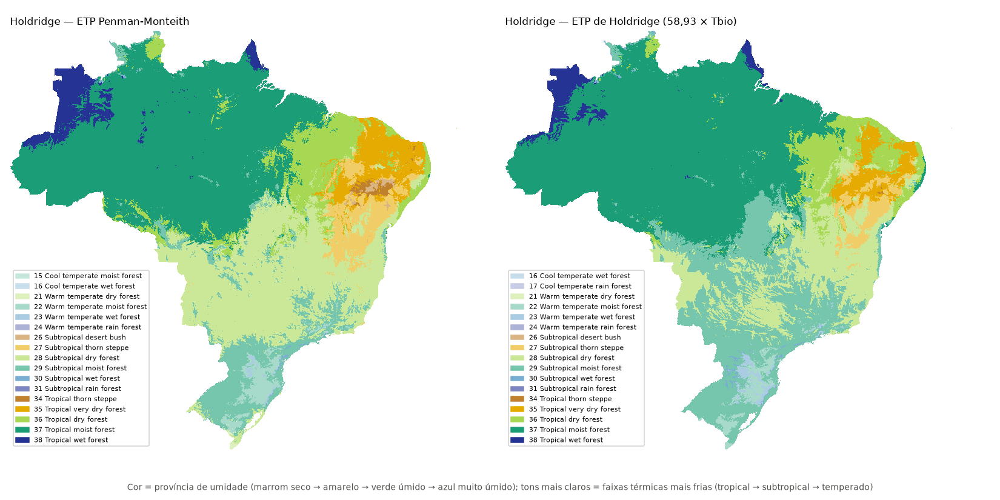
*Figura 4. Zonas de vida de Holdridge com a ETP de Penman-Monteith (esquerda) e a ETP de Holdridge
(direita). A Amazônia é Tropical moist forest (37) nas duas; com a ETP de Holdridge, o Sul e o Sudeste ficam
mais úmidos (Subtropical moist forest, 29, avança sobre a Subtropical dry forest, 28).*


### 4.2 Köppen-Geiger

**Método.** Critérios de Alvares et al. (2013), 31 classes, a partir de `tas` e `pr`.

**Revisão.** Os grupos (A: mês mais frio ≥ 18 °C), o limiar do grupo B, Af/Am/As/Aw, h/k e a/b/c estavam
corretos. Foram encontrados dois erros:
1. **Sazonalidade dos climas C (f/s/w).** O script definia `f` como "mês mais seco ≥ 40 mm" e só testava
   s/w com mês seco < 40 mm. Pixels C com mês seco < 40 mm, mas sem seca sazonal forte, **ficavam sem
   classe**: 50.040 pixels, ~5% da área C do Brasil. Corrigido pelo critério de Kottek et al. (2006): s e w
   mutuamente exclusivos e f = "nem s nem w".
2. **Hemisfério norte.** Verão e inverno não eram trocados ao norte do equador (As/Aw, limiar do grupo B e
   s/w em Roraima e no Amapá). Corrigido.

**Detalhe técnico.** Os assets de classes devem subir com `--pyramiding_policy=mode`. Com a política
padrão (média), as escalas reduzidas mostram classes intermediárias falsas.

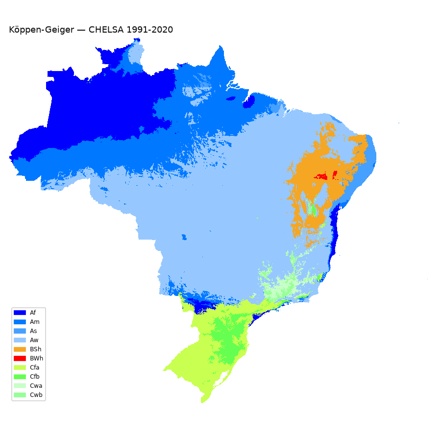
*Figura 5. Köppen-Geiger a partir do CHELSA 1991-2020, já com as correções. Aw domina o Brasil Central
(47% da área), Af/Am a Amazônia, BSh o semiárido, Cfa/Cfb o Sul e Cwa/Cwb as serras do Sudeste.*


### 4.3 Thornthwaite (1948) com balanço hídrico

**Método.** Balanço hídrico climatológico de Thornthwaite & Mather (1955) por pixel, índices hídrico (Ih), de
aridez (Ia) e de umidade (Im = Ih − 0,6·Ia), e as Tabelas 2-5 de Aparecido et al. (2016): classe de umidade,
subtipo sazonal, eficiência térmica e concentração estival da ETP.

**Decisões:**
- **Balanço hídrico pela biblioteca `agrometeorologiapy` do usuário.** A função original rodava ponto a
  ponto em pandas e não servia para ~10 milhões de pixels. Foi criada
  `balanco_hidrico_climatologico_grade` (versão 0.2.0), vetorizada em numpy. Na mesma revisão, a biblioteca
  ganhou três correções:
  (a) **armazenamento inicial de equilíbrio do ciclo anual**, com o ciclo de 12 meses repetido até o ARM de
  dezembro convergir, em vez de começar com o solo cheio em janeiro (que erra onde janeiro é seco, como no
  semiárido e no hemisfério norte);
  (b) o **ALT de janeiro**, que era zerado;
  (c) a **ETP de Thornthwaite acima de 26,5 °C**, que usa a tabela do método original.
  Testes cobrem conservação de água (P = ETR + EXC no equilíbrio) e equivalência com a função pontual.
- **ETP de Penman-Monteith** (escolha do usuário; é também a de Aparecido et al. 2016).
  **Consequência:** 99,5% do Brasil sai A' e 100% sai a' nas letras térmicas, porque os limites dessas
  tabelas foram feitos para a ETP de Thornthwaite. As duas últimas letras quase não diferenciam regiões; a
  informação útil está na umidade e no subtipo.
- **Duas CADs:** 100 mm (padrão dos zoneamentos) e a **CAD do solo = AWC × 1000 × 1 m**. O asset `AWC_br` é
  uma tabela de ~95 mil polígonos (AWC em m³/m³, 0,025-0,21), não uma imagem. Foi rasterizado na grade do
  CHELSA com `ee.Image.paint` (`reduceToImage` estourava a memória do GEE). Corpos d'água ficam sem dado e
  afloramentos de rocha recebem o menor AWC do asset (25 mm).
- **Correções em relação ao script JS:** limite 855 (não 885) na Tabela 4; subtipos s/w dos climas secos
  estavam invertidos; concentração estival com o verão de 3 meses da Tabela 1 (não outubro a março); inverno
  com 1/3 de junho (não 2/3); estações trocadas no hemisfério norte.

**Resultado notável: a CAD quase não muda a classificação** (a classe de umidade é a mesma em 98% da área).
Isso decorre do próprio método: no equilíbrio anual, EXC − DEF = P − ETP, qualquer que seja a CAD. Ela só
redistribui água entre excedente e deficiência.

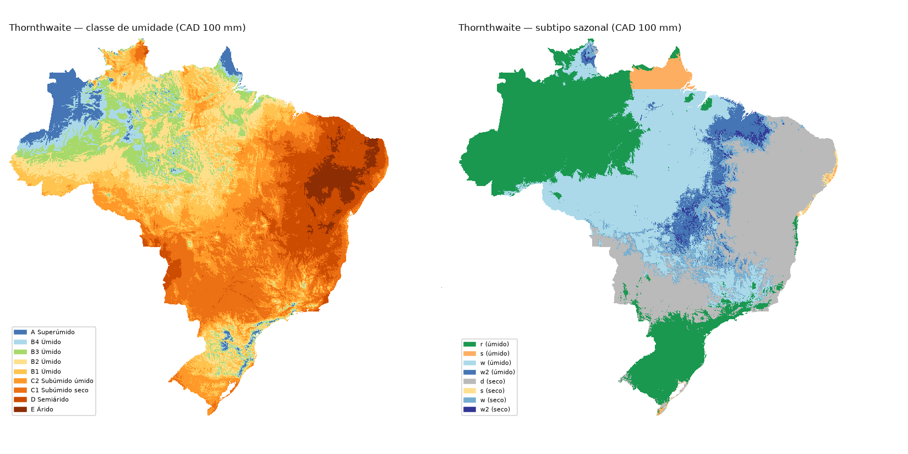
*Figura 6. Thornthwaite com CAD de 100 mm: classe de umidade (esquerda), do superúmido (A) no noroeste
amazônico ao árido (E) no sertão, e subtipo sazonal (direita): r (pouca deficiência) na Amazônia ocidental
e no Sul, w (deficiência no inverno) no Brasil Central, d (pouco excedente) no semiárido. A linha reta no
Amapá é a descontinuidade do equador (troca das estações).*


**Descontinuidade no equador.** Trocar as estações ao norte do equador é o formalmente correto, porque s/w
se referem a verão e inverno locais, e dá o resultado físico certo em Roraima. Mas perto do equador cria um
corte artificial no subtipo, visível no Amapá. Foi mantida a troca e a limitação ficou documentada.

---

## 5. Comparação das classificações como base para SOC e textura

`corelacao/comparacao_climas.ipynb`

### 5.1 Por que a análise foi reestruturada

A análise original seguia um roteiro de orientação: Kruskal-Wallis, ANOVA, Dunn, correlação
ponto-bisserial, Spearman, regressões e importância de variáveis em random forest, com Köppen e o Holdridge do
MapBiomas. Ela respondia muitas perguntas ao mesmo tempo, sem uma decisão clara. Com as novas classificações
disponíveis, a análise foi refeita em torno de **uma pergunta**: qual classificação climática serve melhor de
base para estimar SOC e textura? As análises antigas foram removidas (continuam no histórico do git).

### 5.2 Escolha da métrica

A pergunta foi reformulada antes de escolher a métrica:
1. **Não é correlação.** Clima em classes é uma variável nominal: Pearson e Spearman não se aplicam, e o
   ponto-bisserial mede uma classe de cada vez. O que se mede é quanto da variação cada classificação explica.
2. **Os sistemas têm números de classes muito diferentes** (3 a 32). Mais classes sempre explicam mais dentro
   da amostra; a métrica precisa penalizar isso.
3. **Com ~12 mil locais, todo teste dá p < 0,001**, e p-valores não discriminam entre sistemas.

**Métrica principal: R² fora da amostra com validação cruzada em blocos espaciais.** Cada classificação é o
único preditor, e a estimativa de um local é a média da sua classe calculada nos locais de treino. Os locais
são agrupados em quadrículas de 2° (principal) e de 1° e 5° (sensibilidade), sorteadas em 5 dobras, com
**50 repetições**. Os blocos evitam o otimismo da autocorrelação espacial. O R² fora da amostra penaliza
classes demais sem nenhum ajuste extra e pode ficar negativo quando a classificação estima pior que a média
geral. Todos os sistemas usam as mesmas dobras em cada repetição, então **as diferenças são pareadas** e têm
intervalo de confiança.

**Complemento descritivo: ω²**, o tamanho de efeito da ANOVA de um fator já descontado o número de classes
(ao contrário do η²). As dobras aleatórias também foram rodadas, para mostrar o quanto elas inflam o R²
(ficam praticamente iguais ao ω²).

### 5.3 Dados

- **SOC:** `matriz-collection3_carbon_datac2v2`. Pseudoamostras excluídas, SOC > 0 (a resposta é log(SOC)),
  mediana por local das réplicas anuais: **12.207 locais**.
- **Textura:** `c03_psd_v2025_11_18`. Excluídas amostras artificiais (`pseudo`, `clay-copy-`), horizontes
  fora de 0-30 cm e frações que não fecham 1000 g/kg (±15). Mediana por local, exigindo de novo o
  fechamento em 100% depois de agregar (a mediana coluna a coluna pode não fechar): **11.978 locais**.
- Climas amostrados em cada ponto, na grade nativa dos assets. **Amostra comum:** só entram locais com classe
  em todos os sistemas (~1% saem, no litoral e em corpos d'água).
- **Köppen IPEF L3:** só existe para os grupos B e C. No grupo A, foi completado com o L2 (Af, Am, As e Aw já
  são a classe completa); sem isso, 60% dos locais sairiam da amostra comum.
- **Holdridge:** rotulado pelas zonas de Jungkunst et al. (2021), em duas versões de ETP.
- **Zonas climáticas k10** (seção 6.3): entraram depois, como mais um sistema.

**Concentração da amostra:** ~26% dos locais estão na região de Rondônia e ~19% no Rio Grande do Sul; 20 dos
~200 blocos de 2° reúnem 56-60% dos locais. A validação em blocos atenua o efeito, mas não o elimina.

### 5.4 Resultados

R² fora da amostra, blocos de 2°:

| Sistema | log(SOC) | Areia | Silte | Argila |
|---|---|---|---|---|
| **Zonas climáticas k10** (10 classes) | **0,092** | **0,106** | **0,210** | **0,009** |
| Holdridge L2, ETP de Holdridge | 0,076 | 0,047 | 0,056 | −0,011 |
| Holdridge L2, ETP Penman | 0,068 | 0,049 | 0,075 | −0,020 |
| Thornthwaite L1 (CAD 100 / solo) | 0,067 / 0,068 | 0,060 / 0,055 | 0,061 / 0,058 | −0,008 / −0,011 |
| Thornthwaite L2 (CAD 100 / solo) | 0,051 / 0,054 | 0,066 / 0,071 | 0,199 / 0,191 | −0,04 |
| Köppen IPEF L3 (referência) | 0,067 | 0,049 | 0,142 | −0,015 |
| Köppen CHELSA L3 | 0,039 | 0,032 | 0,145 | −0,055 |

- **As zonas k10 são a melhor classificação isolada.** São as melhores nas quatro variáveis a 1° e 2° e, em
  SOC, areia e silte, vencem todos os outros sistemas em **todas** as repetições.
- **Longe das amostras (5°),** as zonas continuam as melhores em silte; em SOC, o Holdridge L2 fica um pouco à
  frente (0,094 contra 0,083).
- **Entre as clássicas,** o Holdridge L2 (ETH) é o melhor para SOC e o Thornthwaite L2 para silte. No
  Thornthwaite, é o **subtipo** (estação em que falta ou sobra água) que separa o silte.
- **Argila:** nenhuma classificação estima fora da amostra (a argila depende de material de origem e relevo).
- **A CAD do Thornthwaite não importa** (seção 4.3). A **ETP do Holdridge** muda a classificação, mas pouco o
  desempenho; a ETP de Holdridge é igual ou melhor para SOC e é a definição original.
- **Classe climática sozinha explica pouco:** o teto para SOC é R² ≈ 0,09-0,10.

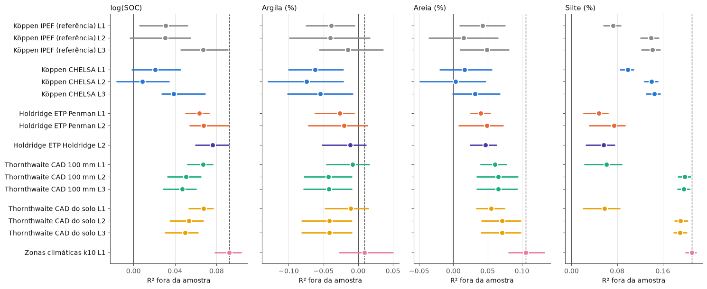
*Figura 7. R² fora da amostra (blocos de 2°) de cada sistema e nível, com o intervalo de 95% entre as 50
repetições. A linha tracejada marca o melhor de cada variável — as zonas k10 (rosa) nas quatro.*

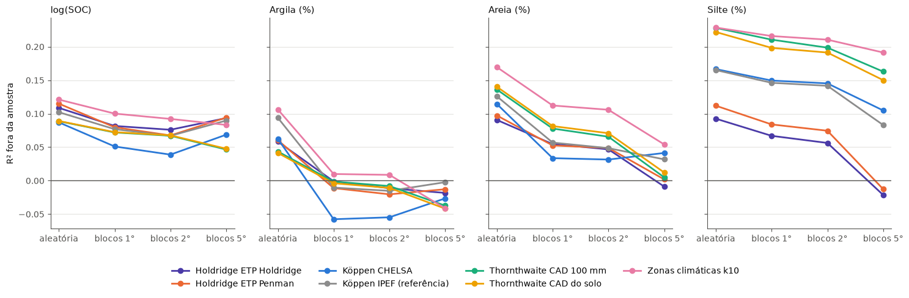
*Figura 8. O mesmo R² em cada esquema de validação, para o melhor nível de cada sistema. Com dobras
aleatórias o R² é otimista (vizinhos no treino); ele cai com blocos maiores. A 5°, o Holdridge alcança as
zonas k10 no SOC; no silte, as zonas lideram em todos os esquemas.*


### 5.5 Por que o Köppen CHELSA fica abaixo do Köppen IPEF

Os dois Köppen concordam em só 56% dos locais. As discordâncias principais são Am → Aw (~3.200 locais em
Rondônia) e C → A (765 locais no Sudeste). Para isolar a causa, foram montadas **classificações híbridas**,
com o CHELSA e uma das discordâncias trocada pela resposta do IPEF. Trocar só o **grupo** onde há A × C
recupera toda a diferença (SOC 0,039 → 0,065; areia 0,032 → 0,062); trocar o subtipo Am/Aw não ajuda. Nos 765
locais C → A, o mês mais frio do CHELSA fica entre 18,2 e 20 °C (metade entre 18 e 19): **estão na
fronteira A/C**, e o SOC deles (≈ 45 Mg/ha) é de clima C (≈ 50) e não A (≈ 36).

**Não é erro de método:** o critério A/C está correto nos dois. A diferença vem dos dados: o período (1991-2020
é mais quente que as normais antigas do IPEF) ou a resolução (regressão com altitude a 100 m no IPEF).
**Interpretação:** o solo integra o clima de séculos; uma fronteira climática recente, deslocada por pouco,
pesa contra quando o objetivo é estimar solo.

---

## 6. Experimento: o que colocar no lugar do Köppen nos modelos do MapBiomas

`corelacao/experimento_clima_modelos.ipynb`

### 6.1 Como o Köppen é usado no MapBiomas

A leitura do repositório `mapbiomas/brazil-soil` (collection_03beta) mostrou que o Köppen **não estratifica**:
entra como **dummies 0/1 dos três níveis** num **único random forest nacional**, ao lado de ~100
covariáveis (solo, geologia, relevo, bioma, fitofisionomia, uso da terra, índices espectrais, água, fogo). E é
a **única informação climática** dos modelos (a precipitação aparece só como comentário "a fazer"; um modelo
com Holdridge aparece comentado). Portanto, a pergunta relevante passou a ser: **o que, no lugar do Köppen,
melhora o modelo completo?**

### 6.2 Desenho

- **Base comum:** todas as covariáveis das matrizes, menos identificadores, alvos, as razões log (`log_*`, que
  são o próprio alvo transformado), os produtos de textura anteriores (`*_000_030cm`) e as dummies de clima
  antigas: 103 covariáveis no SOC e 107 na textura.
- **Modelo:** random forest (200 árvores) para log(SOC), areia, silte e argila; o mesmo para todos, para que só
  o clima varie.
- **Cenários:**

| | Clima no modelo |
|---|---|
| A | Köppen IPEF (hoje) |
| B | sem clima |
| C | Holdridge ETH (dummies) |
| D | Thornthwaite L2 (dummies) |
| E | **12 variáveis climáticas contínuas** (T média, do mês mais frio e mais quente, biotemperatura, P anual, do mês mais seco e sazonalidade, ETP, ETP/P, DEF, EXC, Im) |
| F1 / F2 | zonas homogêneas k-means como covariável / um RF por zona |
| F3 / F4 | zonas supervisionadas (árvore no clima, ajustada dentro da dobra) como covariável / um RF por zona |

- **Validação:** blocos de 2°, 5 dobras × 3 repetições, diferenças pareadas em relação a A.

### 6.3 Zonas climáticas homogêneas (k10)

O pedido foi de zonas definidas a partir das variáveis climáticas. O k-means foi ajustado **nos pixels do
Brasil** (300 mil, amostrados com peso pela área), e não nos locais de solo, por três razões: as zonas
descrevem o clima do país, viram um mapa aplicável em qualquer pixel e não são moldadas pela amostra
concentrada em RO e RS. As zonas também não usam SOC nem textura, então não há vazamento. Foram usadas 9
variáveis padronizadas (chuva, DEF e EXC em log), com k = 10 (o número de classes do Köppen L3 no Brasil) e
k = 15 como sensibilidade. As zonas numeram-se da mais quente para a mais fria e fazem sentido físico: 3-5 são
a Amazônia úmida, 2 e 7 o semiárido e seco-subúmido, 9-10 o Sul. A zona atribuída ao ponto bate 100% com o
mapa.

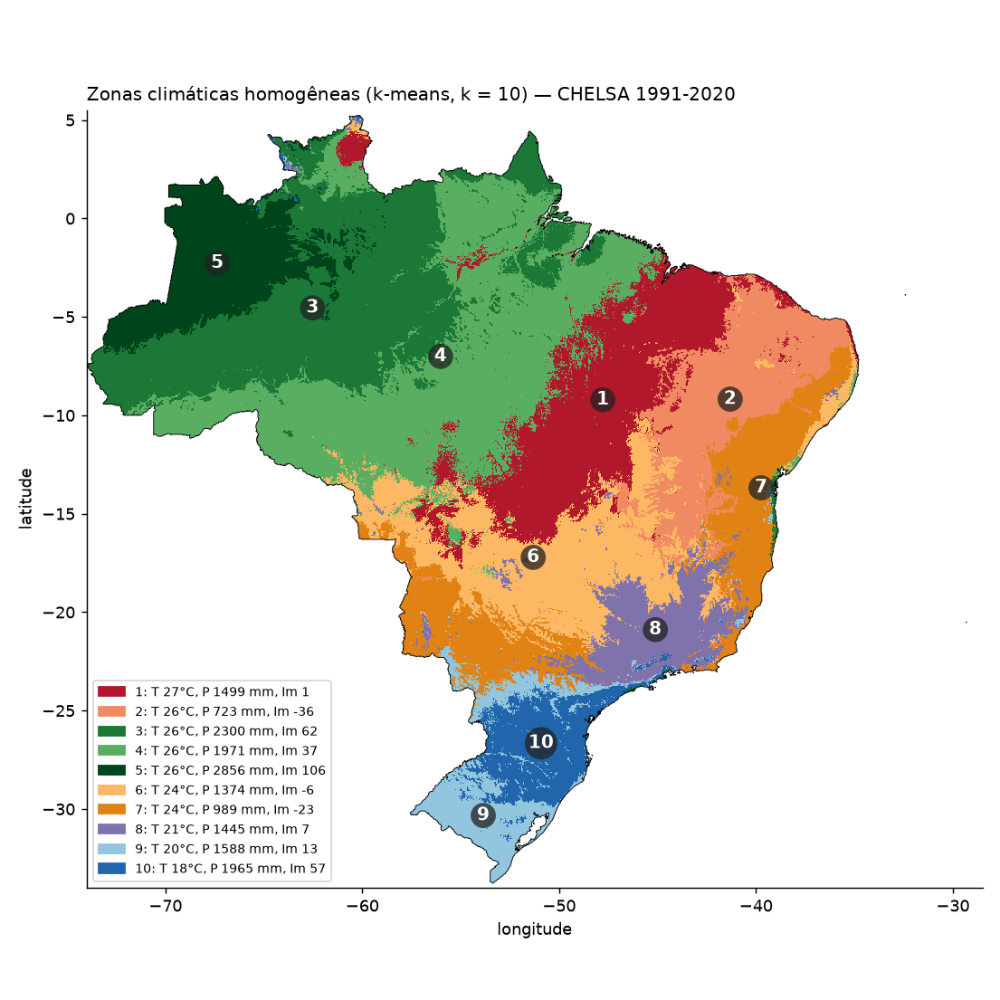
*Figura 9. As 10 zonas climáticas homogêneas, ajustadas por k-means sobre o clima CHELSA dos pixels do
Brasil. A legenda traz a temperatura média, a chuva anual e o índice de umidade (Im) do centro de cada zona.*

As zonas supervisionadas (F3/F4) usam o alvo, então a árvore é ajustada **só com o treino de cada dobra**.

### 6.4 Resultados (ΔR² em relação ao Köppen)

| Cenário | log(SOC) | Silte | Areia | Argila |
|---|---|---|---|---|
| **E: clima contínuo** | **+0,026** | **+0,029** | **+0,009** | +0,004 |
| **F1: zonas k10 (covariável)** | +0,019 | +0,027 | +0,007 | +0,005 |
| D: Thornthwaite L2 | +0,016 | +0,005 | −0,003 | 0,000 |
| C: Holdridge ETH | +0,003 | −0,004 | −0,009 | 0,000 |
| B: sem clima | +0,007 | −0,003 | −0,009 | +0,002 |
| F2/F4: um RF por zona | −0,004 a −0,010 | ≈ 0 | −0,02 a −0,03 | −0,03 a −0,04 |

- **O clima contínuo é a melhor troca**, com ganho em todas as repetições em SOC, silte e areia (SOC: R² de
  0,17 para 0,20).
- **As zonas k10 recuperam a maior parte desse ganho** com só 10 classes.
- **O Köppen contribui pouco hoje:** tirá-lo não piora o SOC. Bioma, fitofisionomia e NDVI já carregam parte
  do sinal climático.
- **O Holdridge, melhor para SOC na comparação isolada, não acrescenta no modelo completo:** o que ele
  informa já está nas outras covariáveis.
- **Estratificar piora:** cada modelo fica com poucos dados e reaprende relações que valem para o país todo.

---

## 7. Reprodução dos modelos do MapBiomas Solo C3

`climas/reproducao/` (código, notebook `reproducao_resultados.ipynb`); dados e mapas em
`climas/dados_reproducao/` (fora do git).

### 7.1 Motivação

O experimento da seção 6 usou um modelo simplificado (random forest em tudo, uma linha por local). Para que
a recomendação valha para o MapBiomas, o teste foi repetido **reproduzindo fielmente** os modelos deles, com
**todos os climas** e **mapas**, em dois experimentos: primeiro a textura, depois o SOC (a ordem do pipeline
deles, porque o SOC usa a textura como covariável).

### 7.2 Como o MapBiomas trata a profundidade e o que foi reproduzido

| | MapBiomas C3 | Reprodução |
|---|---|---|
| Textura | GBM (400 árvores, shrinkage 0,01, samplingRate 0,632, maxNodes 25) **por alvo e por camada de 10 cm** (horizontes a ±5 cm do centro), sobre ln((x+1)/(argila+1)); `profundidade` (ponto médio do horizonte) e textura da coleção 2 como covariáveis; mapas de 0-10 a 90-100 cm | igual, nas camadas de 0-30 cm (centros 5, 15, 25 cm); GBM do scikit-learn sem a subamostragem de 0,632 |
| SOC | RF sobre a matriz com profundidades empilhadas, predição com profundidade = 30 (estoque 0-30 cm), textura de 0-30 cm da C3 como covariável | igual (profundidades empilhadas, profundidade como covariável, avaliação e mapas em 0-30 cm), com a textura de 0-30 cm **prevista pelo modelo de textura do mesmo cenário** |
| Matriz de SOC | `c03_soc_v2025_11_26_trep` (pontos + covariáveis) | **sem acesso de leitura**; usados os **pontos da C3** que a alimentam (`ORIGINAIS/collection3/2025_11_26_soildata_soc_trep`), com as covariáveis extraídas por nós no GEE |

**Dados de SOC.** A primeira versão da reprodução usou a `matriz-collection3_carbon_datac2v2`, a única matriz
de carbono legível, mas com os estoques da **coleção 2** (12.207 locais). Depois foi localizado o asset de
pontos da C3, `ORIGINAIS/collection3/2025_11_26_soildata_soc_trep` (35.235 linhas, 18.325 perfis), o mesmo
conjunto publicado no repositório SoilData (doi [10.60502/SoilData/IUZOAK](https://doi.org/10.60502/SoilData/IUZOAK),
CC BY 4.0). Ele traz, para cada perfil, o estoque de carbono acumulado da superfície até cada profundidade,
com e sem correção de viés por *quantile mapping*; foi usado o corrigido (`carbono_gm2_qmap`). Comparado à
matriz da C2, tem ~3.000 locais novos (sobretudo MT, RO e Pantanal) e estoques recalculados (correlação de
0,85 em log nos mesmos locais). Decisões:
- **Fora:** pseudoamostras (afloramentos, areias) e as réplicas `trep10`/`trep20`, cópias de ~2.300 perfis
  com o ano recuado em 10 e 20 anos e o mesmo carbono (reforçam esses perfis no modelo temporal do MapBiomas,
  mas não trazem informação nova para a validação por local).
- **Covariáveis:** as 106 do modelo de SOC, extraídas no GEE a 30 m com o módulo portado (seção 7.4), no ano
  de coleta de cada amostra (antes de 1985 → 1985; 2024 → 2023, último ano das bordas). Conferidas contra a
  matriz antiga em 200 locais: as estáticas batem em 100%, exceto `sibcs_homogeneo`, que na matriz antiga
  incluía o LATOSSOLO; seguimos a definição da C3, idêntica à da matriz de textura.
- **Resultado:** 25.875 linhas (local × profundidade) em 13.564 locais; 10.892 locais têm o estoque de 0-30 cm,
  que é o avaliado. O RF é treinado com todas as linhas.

A troca elevou o R² do SOC em ~0,06 em todos os cenários (Köppen: 0,275 → 0,336) sem mudar o ranking dos
climas, e aumentou o ganho do clima contínuo. A textura não muda (as dobras são as mesmas).

Foram confirmados na matriz: a razão log é ln((areia+1)/(argila+1)) em g/kg (erro máximo de 0,016 pelo
arredondamento) e a `profundidade` é o ponto médio do horizonte.

**Cadeia textura → SOC sem vazamento.** Em cada dobra, os modelos de textura são treinados só com os
horizontes dos blocos de treino e depois preveem a textura nos locais de SOC. Sem esse cuidado, os perfis com SOC e
textura medidos (a maioria) vazariam a resposta. As dobras são as mesmas na textura e no SOC. Como os
locais de SOC não têm as combinações geologia × solo da matriz de textura, o modelo de textura da cadeia usa
as 82 covariáveis comuns às duas matrizes, mais a profundidade.

### 7.3 A textura da coleção 2 "entrega" a resposta

Na versão fiel, o R² da textura foi a **0,82-0,85** e **nenhum clima fez diferença** (|ΔR²| ≤ 0,003). Os mapas
de textura da coleção 2, usados como covariável, foram ajustados com praticamente as mesmas amostras: o ponto
de teste já está embutido neles, mesmo na validação espacial, e o modelo aprende a copiar o produto anterior.
Por isso a análise foi feita em **duas versões**: **fiel** (com C2) e **sem C2** (`REPRODUCAO_SEM_C2=1`). Sem
C2, o R² da textura cai para 0,29-0,33, o que mostra que **quase todo o desempenho da textura vem do produto
anterior**.

### 7.4 Covariáveis e mapas

- O módulo de covariáveis do MapBiomas (JavaScript do GEE) foi **portado para Python**
  (`covariaveis_gee.py`). As 110 covariáveis da textura saem com os mesmos nomes da matriz. As 24 extras do
  SOC (idades de cada classe de uso, índices espectrais com decaimento, bordas, recorrência de água e de fogo,
  áreas estáveis, subprovíncias) foram conferidas contra 300 linhas da matriz, no ano de cada linha: **100%
  iguais**. A covariável `antropico` corresponde à idade de `agropecuaria`, e o fogo vem da coleção 4.1
  pública.
- **Mapas numa grade de 0,05° (~5 km) alinhada ao CHELSA:** a 1 km, seriam ~10 milhões de pixels × 9 cenários
  × 6 modelos, inviável localmente. Cada pixel usa as covariáveis do centro (um "ponto virtual") e o clima
  de 1 km. O SOC é mapeado para 2023. Pixels sem covariável vinham como −∞ no download e foram mascarados.
- **Pontos de SOC:** as mesmas imagens foram amostradas nos pontos da C3 (seção 7.2).
- **Resultado:** 36 GeoTIFFs (9 cenários × textura e SOC × duas versões).

### 7.5 Resultados

| Ganho de R² sobre o Köppen IPEF | Textura, fiel | SOC, fiel | Textura, sem C2 | SOC, sem C2 |
|---|---|---|---|---|
| **Clima contínuo** | +0,002 | **+0,025** | **+0,023** (silte +0,038) | **+0,038** |
| Zonas k10 | 0,000 | +0,009 | +0,007 | **+0,015** |
| Thornthwaite (as duas CADs) | ~0 | +0,006 | +0,003 | +0,008 a +0,010 |
| Holdridge (as duas ETPs) | ~0 | +0,002 a +0,005 | ~0 | +0,004 a +0,007 |
| Sem clima | ~0 | +0,002 | ~0 | +0,002 |
| Köppen CHELSA | ~0 | −0,001 | +0,002 | −0,002 |

R² de referência (Köppen IPEF): textura 0,82-0,85 (fiel) e 0,29-0,33 (sem C2); SOC 0,336 (fiel) e 0,232
(sem C2), com os pontos da C3.

- **O clima contínuo é a melhor troca nas duas versões:** melhora o SOC em todas as repetições e é o único
  clima que ajuda claramente a textura quando o modelo não depende da C2 (as três frações, em todas as
  repetições).
- **As zonas k10 ficam em segundo.** Thornthwaite e Holdridge ETP Penman também ficam à frente do Köppen no
  SOC em todas as repetições, mas com ganhos menores.
- **O Köppen IPEF não acrescenta nada ao modelo de SOC:** tirar o clima (cenário "sem clima") dá um R² um
  pouco maior que o dele. As outras covariáveis (bioma, fitofisionomia, índices espectrais) já carregam o que
  a classificação sabe.

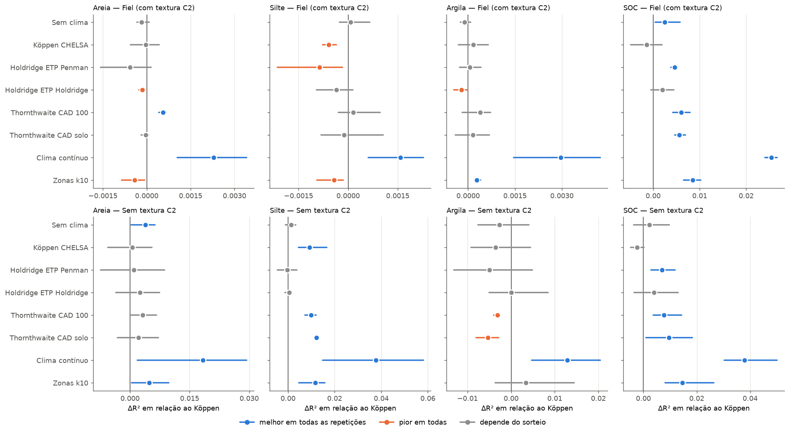
*Figura 10. Ganho de R² de cada clima em relação ao Köppen IPEF, na versão fiel (em cima) e sem a textura da
coleção 2 (embaixo). Azul: melhor em todas as repetições; laranja: pior em todas; cinza: depende do sorteio.
Note as escalas: na versão fiel, os ganhos na textura são de milésimos.*

- **Nos mapas,** a troca muda pouco a média nacional (SOC mediano de ~50 t/ha nos mapas), mas redistribui o carbono:
  com o clima contínuo, **menos SOC num bloco no norte do Pará e no Amapá (baixo Amazonas)** e em trechos
  do litoral Sul/Sudeste, e **mais no noroeste do Amazonas, no Acre, em faixas do Centro-Oeste e na costa do
  Nordeste**.

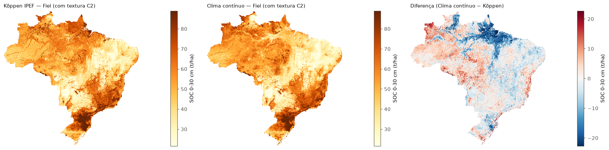
*Figura 11. Estoque de SOC de 0-30 cm em 2023 (t/ha), versão fiel: com o Köppen IPEF, com o clima contínuo e
a diferença entre eles (vermelho = mais carbono com o clima contínuo). Os mapas de SOC têm a correção de
Duan (seção 7.6).*

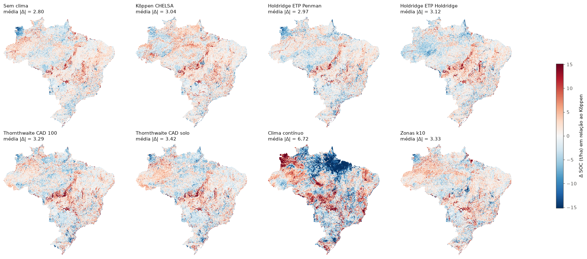
*Figura 12. Diferença de SOC (t/ha) de cada cenário em relação ao Köppen, versão sem textura C2. O clima
contínuo é o que mais redistribui o carbono (|Δ| médio ≈ 6,7 t/ha); os demais ficam entre 2,8 (sem clima) e 3,4 t/ha.*

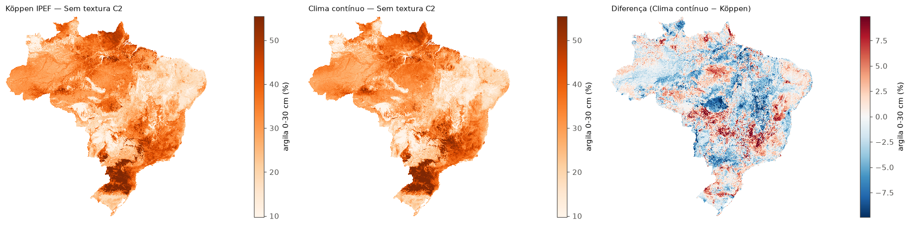
*Figura 13. Argila de 0-30 cm (%), versão sem textura C2: Köppen IPEF, clima contínuo e a diferença.*


### 7.6 Métricas do MapBiomas e comparação com a validação oficial

O MapBiomas valida com a função `error_statistics`: ME (viés), MAE, RMSE, **MEC** (1 − MSE/variância do
observado, a mesma fórmula do R² fora da amostra usado aqui) e **slope** (inclinação de observado ~ previsto;
1 é o ideal, acima de 1 as predições estão "achatadas"). As mesmas métricas foram calculadas
(`metricas_mapbiomas.py`) nas predições fora da amostra, na unidade deles: textura em % e **SOC em t/ha**.

| Versão fiel | ME | MAE | RMSE | MEC | slope |
|---|---|---|---|---|---|
| Areia (%), Köppen / clima contínuo | 0,43 / 0,37 | 6,05 / 5,94 | 10,62 / 10,49 | 0,841 / 0,844 | 0,97 / 0,98 |
| Silte (%), Köppen / clima contínuo | −0,07 / −0,02 | 3,54 / 3,52 | 5,86 / 5,85 | 0,835 / 0,836 | 1,01 / 1,01 |
| Argila (%), Köppen / clima contínuo | −0,35 / −0,36 | 5,14 / 5,07 | 8,70 / 8,59 | 0,818 / 0,822 | 0,98 / 0,98 |
| SOC (t/ha), Köppen / clima contínuo | −9,1 / −8,9 | 20,3 / 20,1 | 48,9 / 48,4 | 0,118 / 0,137 | 1,29 / 1,37 |
| SOC (t/ha) com smearing, Köppen / clima contínuo | −0,1 / −0,5 | 21,3 / 20,9 | 47,8 / 47,3 | 0,156 / 0,176 | 1,08 / 1,16 |

- **Textura:** a reprodução fica na faixa do MapBiomas (MEC 0,81 areia, 0,66 silte, 0,75 argila em 0-100 cm,
  com dobras por perfil e C2 como covariável). A nossa é mais alta porque avalia só 0-30 cm (as camadas
  profundas são piores). Viés pequeno e slope perto de 1.
- **SOC em t/ha:** o MEC é **~0,12** (versão fiel), bem abaixo do R² em log (0,336). Voltar do log com exp()
  estima algo próximo da mediana, e o SOC é muito assimétrico (mediana 47 t/ha, média 55, máximo ~1.360):
  o modelo subestima em média ~9 t/ha. A correção de Duan (*smearing*) elimina o viés e leva o MEC a
  0,16-0,18. O restante é a cauda longa: poucos solos com estoques muito altos dominam o erro quadrático
  (RMSE ≈ 2,4 × MAE). Por isso, os mapas de SOC (Figuras 11 e 12) já aplicam o smearing: o exp() da predição é multiplicado pelo fator de cada cenário (~1,19 na versão fiel, ~1,21 sem C2), calculado nas predições fora da amostra.
- **Comparação com o SOC do MapBiomas:** eles publicam MEC em t/ha de 0,73 (OOB) e 0,58 ("sem vazamento"),
  mas com o estoque acumulado de várias profundidades empilhadas, em que a profundidade explica boa parte;
  e 0,25-0,27 por bioma na camada mais profunda. **O nosso MEC em t/ha (0,12-0,18) fica abaixo** desses
  números. Uma versão anterior deste relatório comparava o R² em log (então 0,275) com o MEC deles em t/ha e
  concluía que estavam na mesma faixa; **essa comparação estava errada** (escalas diferentes). As diferenças
  de matriz, profundidade e validação (a nossa é espacial em blocos, mais exigente) impedem uma comparação
  direta; o número serve só como ordem de grandeza.
- **O ranking dos climas não muda com a métrica:** em t/ha, o clima contínuo também é o melhor (MEC 0,137 ×
  0,118 do Köppen na versão fiel; 0,094 × 0,081 sem C2).

### 7.7 Teste rápido de algoritmos

Um teste numa camada (0-10 cm, sem C2) comparou o GBM do MapBiomas com GBMs mais fortes e com random forest:
**GBMs mais flexíveis pioram na validação espacial** (aprendem detalhes que não valem em regiões novas); o GBM
conservador deles está bem calibrado para extrapolar; o random forest empata ou supera. Trocar o algoritmo
muda o R² em ±0,03-0,05, e **o ganho do clima contínuo se mantém em todos os modelos** (silte +0,06 a +0,08).

---

## 8. Síntese dos resultados

1. **Base climática:** o CHELSA V2.1 é adequado. É equivalente ao Xavier em temperatura, empata com o
   ERA5-Land em chuva e tem 1 km e ETP de Penman-Monteith. A normal de chuva foi regerada depois do
   diagnóstico de um artefato de exportação.
2. **Classificação isolada:** as **zonas climáticas homogêneas k10** separam melhor SOC e textura. Entre as
   clássicas, Holdridge (ETH) para SOC e Thornthwaite L2 para silte. Nenhuma estima argila.
3. **Dentro dos modelos do MapBiomas:** a melhor troca para o Köppen é o **clima contínuo** (12 variáveis do
   CHELSA e do balanço hídrico, todas já em asset no GEE). Se for preciso uma covariável categórica, as
   **zonas k10**. Estratificar os modelos por zona piora.
4. **Covariável de textura da coleção 2:** ela domina o modelo de textura e esconde a contribuição das
   demais covariáveis, inclusive o clima; convém discutir o seu uso com a equipe do MapBiomas.
5. **Magnitude:** os ganhos são modestos em valor absoluto, porque o clima é uma entre ~110 covariáveis, mas
   são consistentes entre repetições e entre algoritmos. No SOC, chegam a 7-16% do R².

---

## 9. Limitações e próximos passos

**Limitações:**
- A matriz de SOC de produção da C3 não é acessível a esta conta; a reprodução usa os mesmos pontos da C3,
  mas com covariáveis extraídas por nós (podem diferir em detalhes das de produção, como `sibcs_homogeneo`).
- A comparação das classificações (seção 5) e o experimento (seção 6) usam a matriz de SOC antiga
  (`carbon_datac2v2`, estoques da C2); só a reprodução (seção 7) passou para os pontos da C3. Como na
  reprodução a troca não mudou o ranking dos climas, as conclusões das seções 5 e 6 devem se manter.
- O GBM do scikit-learn não tem a subamostragem de 0,632 do GEE.
- Os mapas estão a ~5 km (valor do centro do pixel), e não a 30 m.
- O SOC foi modelado em log. A correção de Duan tira o viés médio (~−9 t/ha) dos mapas, mas é um fator único por cenário e não corrige o erro na cauda de solos com estoques muito altos (seção 7.6).
- A validação das bases climáticas usa só 22 estações (2010-2019), com poucas na Amazônia.
- A amostra de solo é concentrada (Rondônia e RS). A validação em blocos atenua, mas os ganhos medidos refletem mais
  essas regiões.
- As classificações com ETP de Penman-Monteith não são diretamente comparáveis a zoneamentos feitos com a
  ETP de Thornthwaite ou de Holdridge nas letras térmicas e nas fronteiras de umidade.

**Próximos passos sugeridos:**
1. Pedir acesso de leitura à `c03_soc_v2025_11_26_trep` e conferir as covariáveis extraídas contra as de
   produção.
2. Gerar os mapas a 30 m no GEE para o Köppen IPEF e o clima contínuo (e as zonas k10, que precisam virar
   asset).
3. Discutir com o MapBiomas o uso da textura da coleção 2 como covariável.
4. Ajustar hiperparâmetros **dentro** da validação espacial e testar a média de GBM e random forest.
5. Mapear a incerteza (random forest quantílico).

---

## 10. Anexo: estrutura do repositório e reprodução

| Pasta | Conteúdo |
|---|---|
| `validacao/` | comparação estações × Xavier, CHELSA, ERA5-Land (`comparacao_v1.ipynb`, `baixar_era5.py`, `atualizar_dados_chelsa.py`) |
| `climas/chelsa_climas_brasil/` | download e normais CHELSA, diagnóstico da chuva, Köppen, Holdridge, Thornthwaite |
| `climas/dados_chelsa/` | dados locais (fora do git) e `assets_utilizados.md` (todos os assets, o que são e onde foram usados) |
| `corelacao/` | comparação de climas (`comparacao_climas.ipynb`), experimento dos modelos (`experimento_clima_modelos.ipynb`), `docs/memoria_fabricio.md` (registro das decisões) |
| `climas/reproducao/` | reprodução dos modelos do MapBiomas C3 (`reproducao_resultados.ipynb`, `codigo/rodar.sh`) |
| biblioteca `agrometeorologiapy` (repositório próprio, v0.2.0) | balanço hídrico vetorizado e correções usadas no Thornthwaite |

**Reprodução resumida:**
```bash
# climas
python climas/chelsa_climas_brasil/baixar_recortar.py && python climas/chelsa_climas_brasil/gerar_normal_multibanda.py
# notebooks holdridge_chelsa, koppen_chelsa, thornthwaite_chelsa -> GeoTIFFs -> subir como assets no GEE

# correlação e experimento
cd corelacao && python codigo/preparar_dados.py && python codigo/comparar_climas.py
python codigo/experimento_dados.py && (cd codigo && python -c "import zonas_clima as z; z.main(ks=(10, 15))")
python codigo/experimento_modelos.py

# reprodução
cd climas/reproducao/codigo && python dados.py && ./rodar.sh && REPRODUCAO_SEM_C2=1 ./rodar.sh
python notebook_resultados.py
```

**Referências citadas:** Alvares et al. (2013), Köppen's climate classification map for Brazil; Aparecido et
al. (2016), Köppen, Thornthwaite and Camargo climate classifications for climatic zoning in the State of
Paraná; Holdridge (1947, 1967); Jungkunst et al. (2021), New uses for old tools: Reviving Holdridge Life Zones
in soil carbon persistence research; Kottek et al. (2006), World map of the Köppen-Geiger climate
classification updated; Leemans (1990, 1992), Global Holdridge life zone classifications; Peel et al. (2007);
Thornthwaite (1948); Thornthwaite & Mather (1955).
