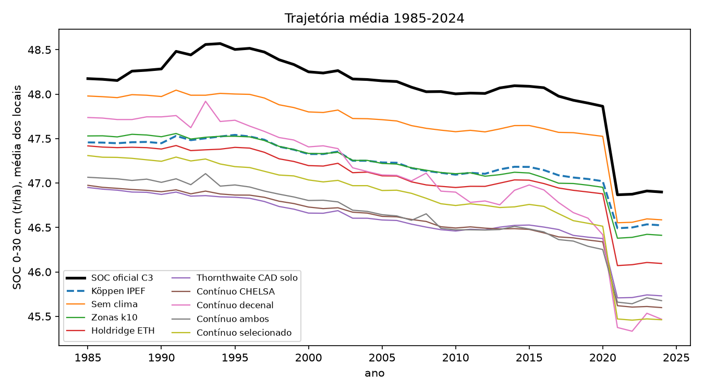
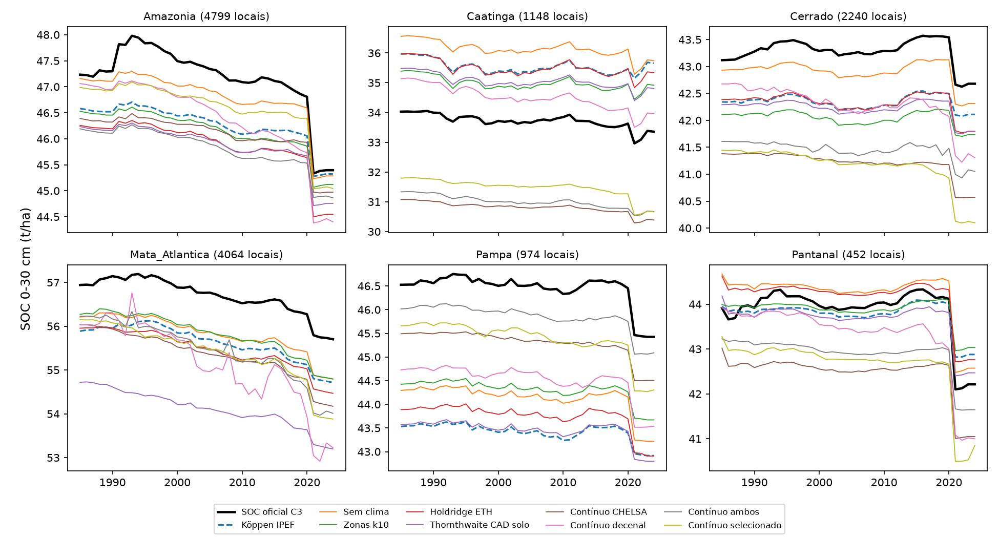

# Relatório técnico v2: os climas no modelo de SOC do MapBiomas Solo C3, no espaço e no tempo (1985-2024)

**Repositório:** `MapBiomas_analises` (GitHub `fcoliveira-utfpr/climate_for_soil`), pasta `climas/analise_espaco_tempo/`
**Período das análises:** 7 e 8 de outubro de 2026
**Escopo:** reconstruir o pipeline de produção do estoque de carbono orgânico do solo (SOC) do MapBiomas Solo
coleção 3 (matriz, covariáveis, filtros, modelo e mapa), comparar nele cinco representações do clima mais um
controle sem clima, com validação **espacial, temporal e espaço-temporal**, e avaliar as trajetórias anuais
de 1985 a 2024. Continua o [relatório v1](relatorio_tecnico.md) (seções 6 e 7 dele).

---

## Sumário

1. [Visão geral e perguntas](#1-visão-geral-e-perguntas)
2. [O que mudou em relação ao relatório v1](#2-o-que-mudou-em-relação-ao-relatório-v1)
3. [Reconstrução do pipeline de produção](#3-reconstrução-do-pipeline-de-produção)
4. [Os cenários de clima](#4-os-cenários-de-clima)
5. [Validação com o modelo validado pelo MapBiomas (ranger)](#5-validação-com-o-modelo-validado-pelo-mapbiomas-ranger)
6. [O modelo que gera o mapa oficial](#6-o-modelo-que-gera-o-mapa-oficial)
7. [Trajetórias 1985-2024](#7-trajetórias-1985-2024)
8. [Síntese](#8-síntese)
9. [Limitações e próximos passos](#9-limitações-e-próximos-passos)
10. [Anexo: arquivos, comandos e reprodução](#10-anexo-arquivos-comandos-e-reprodução)

---

## 1. Visão geral e perguntas

O relatório v1 mostrou, com um modelo próximo do MapBiomas mas não idêntico, que o Köppen IPEF (a única
informação climática dos modelos do MapBiomas Solo) pode ser trocado com vantagem, sobretudo por variáveis
climáticas contínuas. Ficaram três pendências: (i) o modelo não era o de produção (outra matriz, sem réplicas
temporais e pseudoamostras, resposta em log, random forest do scikit-learn); (ii) a validação era só espacial,
num produto que é **anual** (1985-2024); (iii) o clima usado era só a normal estática 1991-2020.

Perguntas desta etapa:

1. É possível reconstruir a matriz e o modelo de SOC de produção a ponto de reproduzir os números
   publicados pelo MapBiomas?
2. Nesse modelo, trocar o Köppen por outro clima melhora a estimativa **em lugares sem amostra** (V2), **em
   anos sem amostra** (V3) e **nos dois ao mesmo tempo** (V4)?
3. Um clima que **varia por década** (temperatura, chuva e dias secos consecutivos decenais) ajuda a
   estimar no tempo?
4. As trajetórias 1985-2024 mudam com o clima? E acompanham o mapa oficial?

---

## 2. O que mudou em relação ao relatório v1

| | Relatório v1 (§7, `climas/reproducao/`) | Agora (`climas/analise_espaco_tempo/`) |
|---|---|---|
| Matriz | pontos da C3 **sem** pseudoamostras e **sem** réplicas `trep`; 25.875 linhas | **idêntica à `c03_soc_v2025_trainingFinal`** (27.425 linhas, 14.704 ids, 13.108 grupos) |
| Covariáveis | 106, da matriz antiga `carbon_datac2v2` | as **131** do script de produção (`covariates_names_static/dynamic`) |
| Ano das covariáveis | ano de coleta (mapas em 2023) | ano de cada linha; painel com **todos os anos 1985-2024** |
| Filtros da matriz | não aplicados | os do script JS de produção (§3.3) |
| Resposta | log(SOC), volta com correção de Duan | `carbono_gm2_qmap` direto (decidido com dados, §5.2) |
| Algoritmo | random forest do scikit-learn | `ranger` com os hiperparâmetros da C3; e o random forest do GEE que gera o mapa (§6) |
| Validação | blocos espaciais de 2° | OOB do MapBiomas + **V2 espacial, V3 temporal, V4 espaço-temporal** |
| Climas | 9 cenários estáticos | 6 cenários + 3 variantes do clima contínuo, com **clima decenal** (GT de clima + CDD do Xavier) |
| Comparação com o produto oficial | não feita | trajetórias e mapa oficial nos 13.680 locais (§6, §7) |

Na v1 o OOB do MapBiomas não era reproduzido (MEC em t/ha de 0,12-0,18 contra 0,58 deles, comparação
reconhecidamente indireta). Aqui ele é reproduzido na segunda casa decimal (§3.4).

---

## 3. Reconstrução do pipeline de produção

### 3.1 Fontes e acesso

| Item | Asset / arquivo | Acesso |
|---|---|---|
| Matriz de produção `c03_soc_v2025_11_26_trep` e `c03_soc_v2025_trainingFinal` | `SOLOS/AMOSTRAS/MATRIZES/collection3/` | **sem acesso** (reconstruídas) |
| Pontos da C3 (35.235 linhas: perfis, 1.944 pseudoamostras de rocha, 1.365 de areia, 4.620 réplicas `trep`) | `SOLOS/AMOSTRAS/ORIGINAIS/collection3/2025_11_26_soildata_soc_trep` | OK |
| Módulo de covariáveis do carbono, matriz e predição | GitHub `mapbiomas/brazil-soil`, `soil_30m_landsat/collection_03beta/carbon/` (`0_covariate_source`, `1_data_matrix`, `2_model_prediction`) | público |
| Filtros, treino e validação em R | mesmo repositório, `soildata/24` a `30` | público |
| Script que gera a `trainingFinal` (listas de covariáveis e filtros) | enviado pelo usuário; cópia em `codigo/referencia/soc_trainingFinal_c3_2025_11_26.js` | — |
| SOC oficial C3, 0-30 cm, t/ha, `carbon_1985` … `carbon_2024` | `SOLOS/PRODUTOS_C03/mapbiomas_soil_collection3_soc_t_ha_000_030cm` | OK |
| Clima decenal do GT de clima (temperatura e chuva) | `SOLOS/COVARIAVEIS/GT_DECADE_{TMEAN,PRECIPITATION}_CONTI_2026` | OK (liberado em 07/10/2026) |
| Máscara de areia do mapa (`MB_2024_SANDMASK`) e fogo acumulado do workspace | `SOLOS/COVARIAVEIS/`, `FOGO_COL4/` | **sem acesso** (fogo: cópia pública da coleção 4.1) |

### 3.2 Covariáveis: porte do módulo do carbono

`codigo/covariaveis_c3.py` traduz literalmente `carbon/0_covariate_source` (versão 2025-10-23): mesmos
assets, mesma ordem e mesmos nomes de banda. A pilha da matriz (`pilha(ano)`) segue `1_data_matrix`:
estáticas e dinâmicas selecionadas, tudo arredondado, mais a banda `year`.

- **Estáticas (110 bandas):** textura C3 de 0-30 cm (média das camadas de 0-10, 10-20 e 20-30 cm do
  `psd_final`), WRB (5 classes + 4 grupos), FAO black soils, pedologia IBGE (16 classes + 5 grupos),
  morfometria (Geomorpho90m, MERIT, curvaturas), Köppen IPEF (13 dummies), biomas, fitofisionomias,
  províncias e subprovíncias geológicas, combinações solo × bioma × litologia, distâncias a afloramentos e
  areias, área estável.
- **Dinâmicas (16 bandas):** idades das classes de uso da Coleção 10 (`formacaoFlorestal`, `vegNatural`,
  `agropecuaria`, `pastagem`, `lavouras`, `areia`, `afloramento`...) e NDVI/EVI2 com decaimento. Antes de
  1985 usa-se 1985; 2024 usa 2023 (os índices vão até 2023).
- **Índices dos pontos (5):** `profundidade`, `IFN_index`, `YEAR_index`, `PSEUDOROCK_index`,
  `PSEUDOSAND_index` (no mapa: profundidade 30 e índices 0).

**O gapfill do original preenche entre bandas, não entre anos.** O `applyGapFill` percorre as bandas da
imagem dinâmica e preenche cada pixel vazio com o valor da banda anterior (ida) e da seguinte (volta). Foi
portado como está. Consequência visível: a recorrência de água dinâmica, vazia onde nunca houve água, recebe
o valor de `mb_edges`, a banda ao lado. Isso explica a correlação água × bordas anotada no R 26 ("WHY?");
a banda é descartada na produção.

**Conferência** (`codigo/conferir_covariaveis.py`, 300 linhas sorteadas de cada matriz legível):

| Matriz de referência | O que foi conferido | Resultado |
|---|---|---|
| `c03_psd_v2025_11_18` (textura C3) | todas as estáticas em comum (exceto a textura) | **100% iguais**; `elevation` 93% (diferença de ~1 pixel do MERIT) |
| `matriz-collection3_carbon_datac2v2` | dinâmicas no ano de cada linha e `Area_Estavel` | **100% iguais**, exceto `mb_water_recurrence_dynamic` (1%: o gapfill acima) |

### 3.3 Matriz: amostragem e filtros

`codigo/matriz.py`: para cada ano dos pontos, a pilha daquele ano é amostrada a 30 m nos pontos daquele
ano (`sampleRegions`), numa única exportação para `projects/fcoliveira/assets/SOC_C3_FABRICIO/
matriz_soc_c3_fabricio_bruta` (35.235 linhas, todas as do asset de pontos).

Os filtros existem em duas versões, R (`26_soc_filter_matrix.R`) e JS (o script da `trainingFinal`), que
diferem em dois pontos: o JS escreve `'resingas'` nos dois filtros de restinga e usa `black_soil_prob > 10`
(o R, `> 50`) no filtro de solo escuro em textura arenosa. As duas foram aplicadas:

| Filtro (descarta) | R: removidas | JS: removidas |
|---|---|---|
| rocha fora de afloramento | 1.071 | 1.071 |
| areia fora de areia | 273 | 273 |
| rocha com NDVI > 147 | 420 | 420 |
| rocha com solo escuro > 10 | 186 | 186 |
| rocha com argila > 0 | 45 | 45 |
| areia com argila > 0 | 66 | 66 |
| areia com solo escuro > 10 | 462 | 462 |
| areia com Wetsols > 10 | 279 | 279 |
| IFN em restinga | 24 | **todo o IFN (4.429 no total)** |
| `YEAR_index` −26 em restinga | 2 | **todo o −26 (106 no total)** |
| solo escuro > 10 em areia (uso) | 1 | 1 |
| solo escuro em textura arenosa (> 50 no R, > 10 no JS) | 2 | 467 |
| água: EVI2 < 100 e recorrência > 0 | 5 | 5 |
| **Linhas finais** | **32.399** | **27.425** |

- **Versão R:** as 13 contagens anotadas no `26_soc_filter_matrix.R` saem **idênticas**.
- **Versão JS:** **27.425 linhas, 14.704 ids e 13.108 grupos, exatamente a `trainingFinal`** (números do
  `30_soc_model_validation.R`). O `'resingas'` não "deixa de filtrar": no GEE a comparação com uma
  propriedade inexistente dá nulo, e o `.not()` de `and(IFN_index == 1, nulo)` também descarta o ponto.
  Saem **todas** as linhas do Inventário Florestal Nacional e todas as de `YEAR_index == −26`, não só as de
  restinga. **Os dados do IFN não entram no modelo de produção da C3**, provavelmente sem intenção.

Fica a versão JS: `climas/dados_espaco_tempo/matriz_soc_c3_fabricio.parquet` (fora do git).

### 3.4 Reprodução do OOB do MapBiomas

`codigo/fidelidade_oob.R` repete o `30_soc_model_validation.R` na matriz reconstruída: `ranger`,
`carbono_gm2_qmap ~ 131 covariáveis`, 300 árvores, mtry 24, min.node.size 2, max.depth 40, semente 1984; OOB
padrão e "sem vazamento" (bootstrap por grupo = perfil + réplicas). Métricas `error_statistics` do MapBiomas
em t/ha.

| OOB (t/ha) | ME | MAE | RMSE | MEC | slope |
|---|---|---|---|---|---|
| Padrão, todas as camadas: **nós** / MapBiomas | 0,32 / 0,32 | 11,72 / 11,74 | 26,67 / 26,73 | **0,73 / 0,73** | 1,10 / 1,10 |
| Padrão, camada mais funda | −1,99 / −1,97 | 13,78 / 13,81 | 32,69 / 32,72 | 0,67 / 0,67 | 1,24 / 1,24 |
| Sem vazamento, todas | 1,13 / 1,04 | 15,68 / 15,63 | 33,23 / 33,29 | **0,58 / 0,58** | 1,03 / 1,04 |
| Sem vazamento, mais funda | −0,99 / −1,07 | 17,32 / 17,27 | 38,38 / 38,48 | 0,54 / 0,54 | 1,19 / 1,19 |

As cinco covariáveis mais importantes também coincidem (profundidade, elevação, restingas, argila,
ESPODOSSOLO). O `ano` não é preditor: a propriedade não existia na matriz de produção, o que fecha as 136
colunas da `trainingFinal` (131 covariáveis + 4 alvos/ids + `system:index`). As diferenças restantes vêm da
ordem das linhas (o inbag por grupo depende dela) e do sorteio.

**A matriz e o modelo validado pelo MapBiomas estão reproduzidos.** Tudo o que segue usa esse ponto de
partida.

---

## 4. Os cenários de clima

### 4.1 Cenários

Só o clima muda entre os cenários; as outras 118 covariáveis são as da produção.

| Cenário | Colunas de clima | Observação |
|---|---|---|
| **Köppen IPEF** | 13 dummies L1-L3 da produção | referência (o que o MapBiomas usa) |
| Sem clima | nenhuma | controle |
| Zonas k10 | 10 dummies (zonas homogêneas, k-means sobre o CHELSA) | melhor classificação na v1 |
| Holdridge ETH | 16 dummies (L1 + L2, ETP de Holdridge) | |
| Thornthwaite CAD do solo | 27 dummies (L1 + L2: umidade + subtipo) | balanço hídrico com a AWC do solo |
| Contínuo CHELSA | 12 variáveis da normal 1991-2020 e do balanço hídrico | melhor cenário da v1 |
| Contínuo decenal | `dec_tmean`, `dec_prec`, `dec_cdd` | **muda por década** |
| Contínuo CHELSA + decenal | as 15 | |
| **Contínuo selecionado** (`cont_sel`) | as 15 com seleção aninhada (§5.4) | |

Dummies de classe com menos de 30 ocorrências são descartadas (regra do R 26). Climas faltantes (≤ 0,6% das
linhas, quase todas no litoral, fora das grades): dummies 0 e contínuas pela mediana.

### 4.2 Clima decenal: GT de clima e CDD calculado do Xavier

As coleções do GT de clima do MapBiomas Solo trazem, para cada ano Y de 1971 a 2026, a **média dos 10 anos
anteriores** (Y−10 a Y−1), a 0,1° (a grade do Xavier/BR-DWGD): `tmean_10yr_mean` (°C) e `prec_10yr_mean`
(mm). A coleção de CDD do GT (`GT_DECADE_CDD_CONTI_2026`) estava **vazia**, então o CDD foi calculado por nós
(`codigo/cdd_brdwgd.py`):

- **CDD anual (índice ETCCDI):** maior sequência de dias com chuva < 1 mm no ano; a estiagem que vem do ano
  anterior continua contando (importante no norte, seca de dezembro a março). Calculado no GEE com arrays
  (soma acumulada dos dias secos menos o valor dela no último dia chuvoso), da chuva diária do Xavier
  (`projects/sat-io/open-datasets/BR-DWGD/PR`, 1961-2022, `mm = b1 × 0,006866665 + 225`).
- **CDD decenal:** média do CDD anual de Y−10 a Y−1; a grade vai até 2022, então 2024 usa 9 anos
  (propriedade `n_anos`). Assets: `projects/fcoliveira/assets/Climas2/CDD_ANUAL_BRDWGD` (62 imagens) e
  `CDD_DECENAL_BRDWGD` (54 imagens, banda `cdd_10yr_mean`).
- **Conferência:** CDD anual de 2010 e 2012 em Petrolina 97 e 208 dias (a seca de 2012), Cuiabá 77 e 88,
  Curitiba 23 e 27, Manaus 14 e 9. Decenal de 2023 (2013-2022): Petrolina 107, Cuiabá 59, Curitiba 26,
  Manaus 12, Boa Vista 36. **Limitação:** a grade interpolada espalha chuvas fracas e encurta as estiagens
  onde há poucos pluviômetros; o CDD da grade tende a ser menor que o de um pluviômetro.

Cada linha da matriz recebe a imagem decenal do **seu ano**, e cada ano do painel a do ano correspondente.

### 4.3 Extração nos locais

`codigo/climas.py`: 14.631 locais (todos os pontos do asset, inclusive pseudoamostras). Estáticos (classes
dos sistemas, 12 contínuas, zona k10) com as mesmas funções da análise solo-clima (`corelacao/codigo`);
decenais por local × ano 1985-2024 (580.600 linhas, sem faltas).

---

## 5. Validação com o modelo validado pelo MapBiomas (ranger)

### 5.1 Desenho

| Esquema | O que mede | Dobras |
|---|---|---|
| **V2 espacial** | estimar onde não há amostra | blocos de 2° (201 blocos), 5 dobras equilibradas em linhas (5,1-6,0 mil cada), 3 repetições com partições diferentes |
| **V3 temporal** | estimar em anos sem amostra | 4 períodos de 10 anos (1985-94, 1995-2004, 2005-14, 2015-24) pelo ano do perfil original; 3 sementes |
| **V4 espaço-temporal** | lugar **e** época novos | teste = dobra espacial f e período p; treino = fora dos dois (20 modelos); 3 repetições, cada uma com a sua partição espacial |

Perfil e réplicas `trep` ficam sempre na mesma dobra (nenhum grupo é dividido; a réplica vai com o período
do perfil original). Modelo: o `ranger` da validação do MapBiomas (300 árvores, mtry 24, min.node.size 2,
max.depth 40), `codigo/validacao.R`. Métricas `error_statistics` em t/ha (`codigo/metricas.py`), em três
recortes:

- **todas as linhas** e **0-30 cm** (linhas com profundidade = 30), como faz o MapBiomas;
- **0-30 cm só com amostras reais** (9.787 linhas): sem réplicas `trep` (cópias de perfis com o ano recuado e
  o mesmo carbono) e sem pseudoamostras (rocha e areia, carbono quase zero), que são fáceis de acertar.

Ganho pareado = MEC do cenário − MEC do Köppen na mesma repetição (mesmas dobras).

### 5.2 Resposta direta ou em log

Köppen, V2, 0-30 cm: direta MEC **0,29**, RMSE 53,5, ME −3,3 t/ha; log(x + 1) com correção de Duan MEC 0,19,
RMSE 57,1, ME −9,2 (pior nas três repetições). **Fica a resposta direta**, como na produção. (601 linhas têm
carbono zero, por isso log(x + 1).)

### 5.3 Resultados

**Amostras reais, 0-30 cm** (o recorte mais relevante). MEC e, entre parênteses, ganho médio sobre o Köppen
[mínimo; máximo nas 3 repetições]:

| Cenário | V2 espacial | V3 temporal | V4 espaço-tempo |
|---|---|---|---|
| **Köppen IPEF** | 0,240 | 0,172 | 0,152 |
| Sem clima | 0,238 (−0,002 [−0,013; +0,005]) | 0,183 (**+0,011** [+0,007; +0,013]) | 0,156 (+0,004 [−0,001; +0,008]) |
| Zonas k10 | 0,241 (+0,001 [−0,005; +0,005]) | 0,174 (+0,002 [−0,001; +0,005]) | 0,153 (+0,001 [−0,004; +0,003]) |
| Holdridge ETH | 0,236 (−0,004 [−0,016; +0,003]) | 0,173 (+0,002 [−0,007; +0,010]) | 0,142 (**−0,010** [−0,018; −0,005]) |
| Thornthwaite CAD solo | 0,243 (+0,003 [−0,003; +0,007]) | 0,181 (**+0,009** [+0,006; +0,012]) | 0,158 (**+0,006** [+0,001; +0,015]) |
| Contínuo CHELSA | 0,254 (**+0,014** [+0,006; +0,027]) | 0,178 (**+0,006** [+0,004; +0,010]) | 0,153 (+0,001 [−0,001; +0,003]) |
| Contínuo decenal | 0,251 (**+0,011** [+0,005; +0,019]) | **0,184** (**+0,013** [+0,009; +0,018]) | **0,159** (+0,007 [−0,002; +0,013]) |
| Contínuo CHELSA + decenal | 0,253 (**+0,012** [+0,001; +0,031]) | 0,173 (+0,002 [−0,003; +0,007]) | 0,146 (**−0,006** [−0,010; −0,003]) |
| **Contínuo selecionado** | **0,255** (**+0,015** [+0,007; +0,029]) | 0,182 (**+0,010** [+0,009; +0,011]) | 0,154 (**+0,002** [+0,001; +0,003]) |

Em negrito, ganhos com o mesmo sinal nas três repetições.

**Todas as linhas, como o MapBiomas avalia** (MEC 0-30 cm; o ranking é o mesmo, com valores mais altos):

| Cenário | V2 | V3 | V4 |
|---|---|---|---|
| Köppen IPEF | 0,293 | 0,215 | 0,192 |
| Sem clima | 0,291 | 0,232 | 0,197 |
| Zonas k10 | 0,292 | 0,216 | 0,192 |
| Holdridge ETH | 0,289 | 0,221 | 0,181 |
| Thornthwaite CAD solo | 0,296 | 0,228 | 0,203 |
| Contínuo CHELSA | 0,311 | 0,224 | 0,202 |
| Contínuo decenal | 0,306 | 0,237 | 0,201 |
| Contínuo CHELSA + decenal | 0,310 | 0,214 | 0,190 |
| Contínuo selecionado | 0,315 | 0,229 | 0,201 |

Leitura:

1. **O Köppen não é o melhor em nenhum esquema.** No espaço (V2), as três variantes do clima contínuo ganham
   dele em todas as repetições; no tempo (V3), ganham dele o decenal, o selecionado, o CHELSA, o
   Thornthwaite e até o **controle sem clima**.
2. **Para estimar em anos novos, o Köppen atrapalha:** tirar o clima melhora o MEC na V3 em todas as
   repetições (+0,011). As 13 dummies deixam o modelo aprender combinações de lugar que não valem em outra
   época.
3. **O clima que muda no tempo é o melhor no tempo:** o decenal tem o maior MEC na V3 e na V4.
4. **Thornthwaite CAD do solo é a melhor das classificações** (ganha na V3 e na V4 em todas as repetições);
   **zonas k10** empatam com o Köppen (na v1 eram as segundas melhores); **Holdridge** é a pior (perde na V4
   em todas as repetições).
5. **Juntar CHELSA e decenal sem seleção não soma** e piora na V4: há 10 pares com |r| > 0,9 (§5.4).
6. **Os ganhos são pequenos:** até ~0,015 de MEC (~0,5 t/ha de RMSE) com amostras reais. As 118
   covariáveis restantes (biomas, fitofisionomias, relevo, uso da terra, índices de vegetação) já carregam
   grande parte da informação climática.

### 5.4 Seleção do clima contínuo

Pares com |r de Spearman| > 0,9 entre as 15 candidatas: ETP/P × Im (−0,99), chuva anual × EXC (0,96), chuva
anual × Im (0,95), temperatura média × temperatura do mês quente (0,95), temperatura média × `dec_tmean`
(0,94), temperatura média × mês frio (0,93), mês frio × biotemperatura (0,93), EXC × Im (0,93), chuva anual ×
ETP/P (−0,93), chuva do mês seco × `dec_cdd` (−0,90).

`cont_sel` faz a seleção **dentro de cada dobra, só com o treino** (`codigo/selecao_continuas.R`): ajusta com
as 15, percorre os pares do maior |r| para o menor e descarta a menos importante de cada par (importância por
impureza); reajusta com as restantes e prevê a dobra de teste. Frequência com que cada variável foi mantida
nas 87 dobras:

| Variável | Mantida | Variável | Mantida |
|---|---|---|---|
| `dec_prec` (chuva decenal) | **100%** | `clim_p_sazonalidade` | 59% |
| `clim_p_mes_seco` | 95% | `clim_p_anual` | 48% |
| `clim_etp_anual` | 93% | `clim_etp_p` | 41% |
| `clim_biotemp` | 84% | `clim_t_mes_quente` | 21% |
| `clim_def_anual` | 79% | `clim_im` | 17% |
| `dec_cdd` | 77% | `clim_t_mes_frio` | 13% |
| `clim_t_media` | 72% | `dec_tmean`, `clim_exc_anual` | 9%, 7% |

No modelo final (matriz inteira) ficaram 8: temperatura média, biotemperatura, chuva anual, chuva do mês
mais seco, sazonalidade da chuva, ETP anual, DEF anual e `dec_prec`. Os passos seguintes do plano
(eliminação para trás por importância por permutação) não foram feitos (§9).

### 5.5 Por bioma e por período

MEC em 0-30 cm (todas as linhas), média das repetições:

| V2, por bioma | Köppen | Sem clima | Thornth. solo | Zonas k10 | Holdridge | Selecionado | Decenal |
|---|---|---|---|---|---|---|---|
| Amazônia | 0,260 | 0,251 | 0,259 | 0,259 | 0,250 | 0,263 | **0,265** |
| Caatinga | −0,018 | −0,029 | 0,052 | 0,012 | 0,029 | **0,126** | 0,029 |
| Cerrado | 0,145 | 0,144 | 0,147 | 0,147 | 0,146 | **0,148** | 0,147 |
| Mata Atlântica | 0,293 | 0,294 | 0,295 | 0,287 | 0,290 | **0,334** | 0,316 |
| Pampa | 0,267 | 0,274 | 0,293 | **0,329** | 0,252 | 0,245 | 0,246 |
| Pantanal | −0,079 | −0,046 | **0,004** | −0,050 | 0,003 | −0,077 | −0,066 |

| V3, período deixado de fora | Köppen | Sem clima | Thornth. solo | Selecionado | Decenal |
|---|---|---|---|---|---|
| 1985-1994 | 0,117 | 0,125 | **0,126** | 0,112 | 0,121 |
| 1995-2004 | 0,001 | −0,014 | 0,014 | **0,054** | 0,011 |
| 2005-2014 | 0,296 | 0,325 | 0,305 | 0,322 | **0,335** |
| 2015-2024 | 0,329 | 0,354 | **0,374** | 0,340 | 0,366 |

O ganho do clima contínuo vem sobretudo da **Caatinga** e da **Mata Atlântica**; no Pampa, as zonas k10 e o
Thornthwaite são melhores. Prever 1995-2004 sem amostras desse período é quase impossível com qualquer
clima (MEC ~0), o que mostra o peso da composição temporal da amostragem.

### 5.6 Importância do clima no modelo

Importância por impureza (fração do total) das colunas de clima no modelo final de cada cenário:

| Cenário | Importância somada | Melhor posição entre as covariáveis |
|---|---|---|
| Köppen IPEF (13 dummies) | 2,8% | 29ª |
| Zonas k10 | 2,5% | 28ª |
| Holdridge ETH | 3,4% | 32ª |
| Thornthwaite CAD solo | 4,7% | 23ª |
| Contínuo decenal (3) | 10,6% | 5ª |
| Contínuo CHELSA (12) | 30,3% | 4ª |
| Contínuo selecionado (8) | 25,6% | 4ª (biotemperatura), 5ª (temperatura média), 6ª (chuva do mês seco) |

No modelo de produção, as variáveis mais importantes são profundidade (9,6%), elevação (8,3%), idade de
restinga (6,4%), argila (4,3%) e ESPODOSSOLO (4,0%). As variáveis contínuas entram logo depois da
profundidade e da elevação; as dummies de classe quase não são usadas.

---

## 6. O modelo que gera o mapa oficial

### 6.1 O mapa não é feito com o modelo validado

O script `carbon/2_model_prediction` (GitHub do MapBiomas) treina o modelo do mapa no próprio GEE:

```js
ee.Classifier.smileRandomForest({numberOfTrees: 300, variablesPerSplit: 24, minLeafPopulation: 2,
                                 bagFraction: 0.632, maxNodes: 40, seed: 2021})   // classProperty: carbono_gm2_qmap
```

`maxNodes: 40` limita **cada árvore a 40 folhas**. Na validação em R (R 28 e R 30), o parâmetro foi traduzido
como `max.depth = 40`, que no `ranger` é profundidade e na prática não limita nada (árvores com milhares de
folhas). O R 30 descreve o modelo como "(virtually) the same method used in Google Earth Engine", mas **são
modelos diferentes**: os números publicados (MEC 0,73 e 0,58) são do modelo profundo, e o mapa vem do raso.

Pós-processamento do mapa, no mesmo script:

- SOC = 0 onde o uso do ano é 23 (dunas, praias), 24 (urbano) ou 30 (mineração), ou o grupo textural é 1;
- SOC = 10 t/ha onde `MB_2024_SANDMASK` = 1 (áreas que já foram areia);
- 1985-1987: onde o uso foi estável de 1985 a 1989, o valor é trocado pela mediana de 1985-1989;
- arredondamento para t/ha inteiras.

### 6.2 Reprodução do mapa oficial

`codigo/fidelidade_gee.py` emula o modelo do GEE no scikit-learn (árvores crescidas pelo maior ganho
primeiro com `max_leaf_nodes = 40`, como o Smile; 24 variáveis por divisão; 63,2% das linhas **sem
reposição** em cada árvore; semente 2021), treina na matriz reconstruída, prevê o painel (13.680 locais ×
40 anos, profundidade 30, índices 0) e aplica o pós-processamento (`codigo/mascaras_mapa.py` extrai o uso e o
grupo textural; os 3 locais com 10 t/ha no oficial, prováveis máscara de areia, ficam fora).

| Contra o SOC oficial (13.677 locais × 40 anos) | **GEE emulado + pós-proc.** | ranger validado + pós-proc. | ranger, sem pós-proc. |
|---|---|---|---|
| Média (oficial 48,07 t/ha) | **47,22** | 51,68 | 52,53 |
| r local-ano | **0,917** | 0,815 | 0,754 |
| MEC | **0,80** | 0,05 | −0,14 |
| Valores idênticos / diferença ≤ 1 t/ha | **18% / 49%** | 6% / 15% | 0% / 9% |
| Tendência média (oficial −0,28 t/ha/década) | **−0,22** | +0,08 | +0,33 |
| r da tendência por local | **0,89** | 0,77 | 0,21 |
| r da média anual | **0,97** | 0,39 | −0,07 |
| Variação ano a ano por local (oficial 0,18) | **0,15** | 0,73 | 0,76 |

Com o modelo raso e o pós-processamento, o nível, a queda 1985-2024 e a suavidade do mapa oficial são
recuperados. O restante é a diferença entre o Smile e a emulação (sorteios, desempates, tratamento de
empates em variáveis inteiras), que não dá para igualar fora do GEE.

### 6.3 O modelo do mapa acerta menos que o modelo validado

V2 com o Köppen (3 repetições), modelo do mapa emulado × ranger validado:

| MEC (V2, Köppen) | ranger (`max.depth` 40) | modelo do mapa (`maxNodes` 40) |
|---|---|---|
| Todas as linhas | 0,344 | 0,283 |
| Todas, 0-30 cm | 0,293 | 0,228 (ME −8,5 t/ha) |
| Amostras reais, 0-30 cm | 0,240 | 0,180 (ME −7,4 t/ha) |

As árvores rasas custam ~0,06 de MEC e subestimam o SOC em ~7-8 t/ha nos pontos de validação: o mapa
publicado é mais suave e mais enviesado para baixo do que o modelo cujas métricas foram divulgadas.

### 6.4 Os climas com o modelo do mapa

`codigo/validacao_gee.py` repete a validação da seção 5 (mesmos cenários, dobras, repetições e seleção
aninhada) com o modelo do mapa emulado. Responde à pergunta prática: **trocar o Köppen melhoraria o mapa
publicado?**

**Amostras reais, 0-30 cm.** MEC e ganho sobre o Köppen [mínimo; máximo nas 3 repetições]; em negrito, o
mesmo sinal nas três:

| Cenário | V2 espacial | V3 temporal | V4 espaço-tempo |
|---|---|---|---|
| **Köppen IPEF** | 0,179 | 0,124 | 0,111 |
| Sem clima | 0,187 (**+0,007** [+0,002; +0,017]) | 0,129 (**+0,005** [+0,003; +0,006]) | 0,121 (**+0,010** [+0,006; +0,013]) |
| Zonas k10 | 0,187 (**+0,008** [+0,007; +0,008]) | 0,128 (**+0,004** [+0,002; +0,004]) | 0,115 (+0,004 [−0,003; +0,011]) |
| Holdridge ETH | 0,186 (+0,007 [−0,001; +0,019]) | 0,124 (+0,000 [−0,006; +0,004]) | 0,108 (−0,004 [−0,008; +0,001]) |
| Thornthwaite CAD solo | 0,189 (**+0,010** [+0,004; +0,021]) | **0,134** (**+0,010** [+0,008; +0,013]) | 0,116 (+0,005 [−0,001; +0,015]) |
| Contínuo CHELSA | **0,213** (**+0,034** [+0,022; +0,045]) | 0,107 (**−0,016** [−0,019; −0,013]) | 0,109 (−0,003 [−0,014; +0,007]) |
| Contínuo decenal | 0,195 (**+0,015** [+0,006; +0,027]) | 0,132 (**+0,008** [+0,002; +0,012]) | **0,122** (**+0,011** [+0,003; +0,020]) |
| Contínuo CHELSA + decenal | 0,209 (**+0,030** [+0,018; +0,039]) | 0,111 (**−0,013** [−0,018; −0,010]) | 0,107 (**−0,004** [−0,005; −0,002]) |
| Contínuo selecionado | 0,204 (**+0,025** [+0,011; +0,032]) | 0,120 (−0,004 [−0,011; +0,008]) | 0,114 (+0,003 [−0,001; +0,005]) |

**Todas as linhas, 0-30 cm** (critério do MapBiomas):

| Cenário | V2 | V3 | V4 |
|---|---|---|---|
| Köppen IPEF | 0,229 | 0,159 | 0,139 |
| Sem clima | 0,241 | 0,158 | 0,154 |
| Zonas k10 | 0,239 | 0,161 | 0,142 |
| Holdridge ETH | 0,240 | 0,162 | 0,139 |
| Thornthwaite CAD solo | 0,248 | **0,174** | 0,150 |
| Contínuo CHELSA | **0,277** | 0,139 | 0,150 |
| Contínuo decenal | 0,251 | 0,171 | **0,161** |
| Contínuo CHELSA + decenal | 0,273 | 0,149 | 0,152 |
| Contínuo selecionado | 0,270 | 0,163 | 0,155 |

Todos os cenários têm viés de −7 a −10 t/ha (o modelo raso subestima); o clima não corrige isso.

Leitura:

1. **Com o modelo do mapa, o Köppen é o pior ou quase o pior em todos os esquemas**; até o controle sem
   clima ganha dele nos três, em todas as repetições (amostras reais).
2. **No espaço, o ganho do clima contínuo dobra** em relação ao ranger (+0,034 com amostras reais, +0,048
   com todas as linhas): com árvores rasas, as poucas divisões disponíveis aproveitam melhor um gradiente
   climático contínuo do que 13 dummies.
3. **Mas as normais estáticas (CHELSA) pioram no tempo** (V3 −0,016 em todas as repetições): com só 40
   folhas por árvore, as variáveis estáticas de clima tomam divisões que, sem elas, iriam para o uso da terra
   e os índices de vegetação, que são o que varia no tempo.
4. **O clima decenal é o único que ganha do Köppen nos três esquemas, em todas as repetições** (+0,015,
   +0,008, +0,011), e o Thornthwaite CAD do solo é a melhor classificação (ganha na V2 e na V3).
5. A seleção aninhada (`cont_sel`) manteve quase as mesmas variáveis que com o ranger (`dec_prec` 100%,
   chuva do mês seco 97%, ETP 94%, DEF 78%, `dec_cdd` 77%), mas, com o modelo raso, perde a vantagem no
   tempo.

---

## 7. Trajetórias 1985-2024

### 7.1 Painel e predição

`codigo/painel.py`: 13.680 locais de amostras reais (sem pseudoamostras) × 40 anos = 547.200 linhas, com as
estáticas extraídas uma vez e as dinâmicas de cada ano (41 tarefas no GEE); profundidade 30 e índices 0, como
no mapa. O `sampleRegions` devolve a geometria no centro do pixel da imagem amostrada (~5 m do ponto, em
grades diferentes nas estáticas e nas dinâmicas), então cada linha foi casada com o local original mais
próximo (tolerância de 20 m, casamento 1 para 1). Predições: `prever_painel.R` (ranger) e
`prever_painel_gee.py` (modelo do mapa + pós-processamento). SOC oficial extraído nos mesmos locais
(`soc_oficial.py`, sem faltas).

### 7.2 Trajetória média e efeito do clima (modelo do mapa)


*Figura 1. SOC médio de 0-30 cm nos 13.677 locais, 1985-2024: oficial (preto), o Köppen reproduzido
(tracejado) e os demais cenários, todos com o modelo do mapa e o pós-processamento.*


*Figura 2. O mesmo, por bioma.*

| Cenário (modelo do mapa) | SOC médio (t/ha) | Tendência média (t/ha/década) | r da tendência com o Köppen | r da tendência com o oficial | Variação ano a ano | Diferença média absoluta para o Köppen (t/ha) |
|---|---|---|---|---|---|---|
| **SOC oficial** | 48,07 | −0,28 | 0,89 | 1 | 0,18 | — |
| Köppen IPEF | 47,22 | −0,22 | 1 | 0,89 | 0,15 | 0 |
| Sem clima | 47,66 | −0,28 | 0,99 | 0,89 | 0,16 | 1,04 |
| Zonas k10 | 47,21 | −0,26 | 0,99 | 0,89 | 0,14 | 1,06 |
| Holdridge ETH | 47,06 | −0,27 | 0,99 | 0,90 | 0,16 | 1,09 |
| Thornthwaite CAD solo | 46,57 | −0,25 | 0,99 | 0,87 | 0,14 | 1,45 |
| Contínuo CHELSA | 46,58 | −0,28 | 0,97 | 0,85 | 0,09 | 2,98 |
| Contínuo decenal | 47,08 | −0,53 | 0,95 | 0,85 | 0,31 | 1,56 |
| Contínuo CHELSA + decenal | 46,62 | −0,32 | 0,97 | 0,83 | 0,16 | 3,09 |
| Contínuo selecionado | 46,83 | −0,37 | 0,97 | 0,84 | 0,14 | 2,75 |

- **As classificações quase não mudam a forma das trajetórias** (r da tendência com o Köppen ≥ 0,98) e
  deslocam o nível em ~1 t/ha por local. Como são normais estáticas, só redistribuem o carbono no espaço.
- **O clima contínuo redistribui mais** (2,8-3,1 t/ha por local) e baixa a média em ~0,5 t/ha.
- **Só o clima decenal muda a dinâmica:** a tendência média dobra (−0,53 t/ha/década) e a variação ano a ano
  também (0,31), porque a chuva e o CDD da década anterior mudam a cada ano.
- **Queda de 2021.** Todas as trajetórias, inclusive a oficial, caem ~1 t/ha de 2020 para 2021 (39% dos
  locais caem no oficial, contra ~5% num ano comum). Como acontece em todos os cenários, inclusive sem clima,
  vem das covariáveis dinâmicas do produto; nenhuma idade de uso muda de forma anormal, e o que mais se
  aproxima é o NDVI/EVI2 com decaimento (cai em 45% dos locais). A causa exata fica em aberto.

Com o ranger (sem pós-processamento) as trajetórias sobem (+0,15 a +0,38 t/ha/década, exceto o decenal,
−0,20), ficam ~4,5 t/ha acima do oficial e variam ~4 vezes mais de ano a ano
(`trajetorias_efeito_clima.csv`; figuras `trajetorias_media.png` e `trajetorias_biomas.png`).

### 7.3 Resposta às mudanças de uso

Conversões detectadas pelas idades de uso do painel; variação prevista do ano anterior até 5 anos depois:

| Evento | n | Oficial | Modelo do mapa (faixa entre cenários) | Ranger (faixa entre cenários) |
|---|---|---|---|---|
| vegetação natural → agropecuária | 4.256 | −0,99 t/ha | −0,35 (Thornthwaite) a −0,58 (k10); Köppen −0,58 | −1,05 (CHELSA + decenal) a −1,82 (decenal); Köppen −1,53 |
| pastagem → lavoura | 550 | +0,01 | −0,12 a +0,11; Köppen 0,00 | −0,36 (decenal) a +0,11; Köppen +0,10 |

A perda de carbono com o desmatamento é pequena em todos (cerca de 1 t/ha em 5 anos, 2% do estoque médio).
O clima muda a magnitude, não o sinal.

### 7.4 A verdade de campo para a variação no tempo

São só **289 pares** (local × profundidade) com coletas em anos diferentes, quase todos do conjunto
`ctb0080` a 20 cm (na profundidade de 30 cm, só 8). Neles, o SOC observado **cai 0,49 t/ha** em média entre a
primeira e a última coleta. As predições fora da amostra (V2, V3, V4) **sobem** em média em quase todos os
cenários e nos dois modelos (−0,004 a +0,51 t/ha); a correlação entre a variação observada e a prevista vai de
−0,28 a +0,22 e a
concordância de sinal fica entre 25% e 53%, o nível do acaso.

**Nenhum modelo, com nenhum clima, reproduz a variação temporal observada.** Com tão poucos pares,
concentrados num só conjunto de dados, isso é antes um alerta do que uma medida: a variação no tempo dos mapas
anuais não tem validação independente.

---

## 8. Síntese

1. **Reprodução.** A matriz de treino reconstruída é idêntica à `trainingFinal` (27.425 linhas, 14.704 ids,
   13.108 grupos) e o OOB do MapBiomas sai igual na segunda casa decimal (MEC 0,73 e 0,58). O mapa oficial é
   reproduzido com o modelo raso do GEE e o pós-processamento (r 0,92, MEC 0,80 contra o oficial).
2. **Dois achados sobre o pipeline de produção:**
   - o erro de digitação `'resingas'` tira do treino **todo o Inventário Florestal Nacional** (4.429 linhas)
     e todas as amostras com `YEAR_index` −26, não só as de restinga;
   - **o modelo do mapa não é o modelo validado:** o mapa usa árvores de no máximo 40 folhas
     (`maxNodes: 40` no `smileRandomForest`), enquanto as métricas publicadas são de um `ranger` com
     `max.depth = 40`, praticamente sem limite. O modelo do mapa acerta menos (MEC 0,18 × 0,24 em amostras
     reais, V2) e subestima o SOC em ~7-8 t/ha nos pontos de validação.
3. **O Köppen não é a melhor representação do clima em nenhum esquema, com nenhum dos dois modelos.** No
   modelo do mapa, até tirar o clima é melhor que o Köppen nos três esquemas.
4. **A melhor troca depende do objetivo:**

   | Objetivo | Modelo validado (ranger) | Modelo do mapa (GEE) |
   |---|---|---|
   | Estimar onde não há amostra (V2) | contínuo selecionado (+0,015) | contínuo CHELSA (+0,034) |
   | Estimar em anos sem amostra (V3) | contínuo decenal (+0,013) | Thornthwaite CAD solo (+0,010), decenal (+0,008) |
   | Lugar e época novos (V4) | decenal / Thornthwaite (+0,006 a +0,007) | decenal (+0,011) |
   | **Ganha nos três esquemas** | contínuo selecionado | **contínuo decenal** |

   O **clima decenal** (chuva e temperatura da década anterior, do GT de clima, e o CDD do Xavier) é a única
   opção que ganha do Köppen nos três esquemas com o modelo do mapa, e a única que muda a dinâmica das
   trajetórias. O **Thornthwaite CAD do solo** é a melhor classificação. As **zonas k10** e o **Holdridge**
   não ajudam.
5. **Os ganhos são pequenos:** 0,01-0,03 de MEC (até ~1 t/ha de RMSE). O clima não é o gargalo do modelo;
   o desempenho é limitado pela amostragem (prever 1995-2004 sem amostras desse período dá MEC ~0) e, no mapa,
   pelas árvores rasas.
6. **A variação temporal não está validada:** nos 289 pares com coletas repetidas, nenhum modelo acerta nem
   o sinal da mudança.

---

## 9. Limitações e próximos passos

**Limitações**

- **Emulação do modelo do GEE.** O `smileRandomForest` foi emulado no scikit-learn; o mapa oficial é
  reproduzido com r 0,92, não exatamente. Rodar a validação no próprio GEE ficou fora de alcance (o projeto
  entrou em modo restrito de cota não comercial em 08/10/2026).
- **Máscara de areia** (`MB_2024_SANDMASK`) ilegível: os 3 locais com 10 t/ha no oficial ficaram fora da
  comparação de trajetórias.
- **Ordem das linhas:** o OOB "sem vazamento" depende da ordem das linhas do CSV deles, que não temos; daí
  as diferenças na terceira casa decimal.
- **Seleção do clima contínuo incompleta:** só o passo de redundância (|r| > 0,9) foi feito; a eliminação
  para trás por importância por permutação (passo 3 do plano) não.
- **mtry fixo em 24** em todos os cenários (como na produção); a sensibilidade com mtry proporcional não foi
  rodada.
- **CDD da grade interpolada** tende a subestimar as estiagens onde há poucos pluviômetros.
- **V3 e V4 dependem da distribuição temporal das amostras:** 1985-1994 e 1995-2004 têm muitas linhas
  antigas (perfis anteriores a 1985 entram como 1985), e o último período (2015-2024) tem poucas.
- **Verdade de campo temporal** restrita a 289 pares, quase todos de um conjunto (`ctb0080`, 20 cm).
- **Queda de 2021** observada no produto e na reprodução, de causa não identificada.

**Próximos passos**

1. **Capítulo 2 (pedido):** mesmas configurações (matriz, covariáveis, dobras, recorte de amostras reais),
   trocando só o algoritmo (GBMs, random forest com outros hiperparâmetros, outros), para ver se algum
   modelo chega mais perto do carbono medido.
2. Informar o MapBiomas Solo dos dois achados do pipeline (`'resingas'` e `maxNodes` × `max.depth`).
3. Completar a seleção do clima contínuo (eliminação para trás) e testar mtry proporcional.
4. Investigar a queda de 2021 nas covariáveis dinâmicas.
5. Reunir mais locais com coletas repetidas (outras bases do SoilData) para validar a variação temporal.

---

## 10. Anexo: arquivos, comandos e reprodução

Código em `climas/analise_espaco_tempo/codigo/` (versionado); dados por ponto em `climas/dados_espaco_tempo/`
(fora do git, restritos); tabelas e figuras em `climas/analise_espaco_tempo/resultados/`. Plano e decisões:
`climas/analise_espaco_tempo/planejamento.md`.

| Etapa | Script | Saída principal |
|---|---|---|
| CDD anual e decenal (GEE) | `cdd_brdwgd.py anual`, `cdd_brdwgd.py decenal` | `Climas2/CDD_{ANUAL,DECENAL}_BRDWGD` |
| Covariáveis da C3 | `covariaveis_c3.py` (módulo), `conferir_covariaveis.py` | `conferencia_covariaveis.csv` |
| Matriz | `matriz.py exportar`, `baixar`, `filtrar` | `matriz_soc_c3_fabricio.parquet`, `filtros_matriz.csv` |
| Painel 1985-2024 | `painel.py exportar`, `baixar` | `painel_soc_c3_fabricio_1985_2024.parquet` |
| Climas nos locais | `climas.py` | `climas_locais.parquet`, `climas_decenais.parquet` |
| OOB do MapBiomas | `Rscript fidelidade_oob.R` | `fidelidade_oob.csv` |
| Cenários e dobras | `cenarios.py` | `matriz_cenarios.parquet`, `cenarios.json` |
| Validação (ranger) | `Rscript validacao.R todos v2,v3,v4 direta` (e `koppen_ipef v2 log`) | `oof/*.parquet` |
| Validação (modelo do mapa) | `validacao_gee.py todos` | `oof_gee/*.parquet` |
| Métricas | `metricas.py ranger`, `metricas.py gee` | `validacao_{metricas,ganhos,periodo_bioma}{,_gee}.csv` |
| Mapa oficial e pós-processamento | `soc_oficial.py`, `mascaras_mapa.py`, `fidelidade_gee.py` | `fidelidade_mapa_oficial.csv` |
| Painel por cenário | `painel_cenarios.py`, `Rscript prever_painel.R`, `prever_painel_gee.py` | `painel_predicoes{,_gee}.parquet`, `importancia_cenarios.csv` |
| Trajetórias | `trajetorias.py [gee]`, `trajetorias.py variacao [gee]` | `trajetorias_*.csv`, `trajetorias_*.png` |

Ambiente: Python 3.13 (earthengine-api, pandas, scikit-learn 1.9), R 4.6.1 com `ranger` 0.18, `data.table`,
`arrow` e `jsonlite` (pacotes em `R_LIBS_USER`). Os scripts do GEE usam `corelacao/codigo/gee_utils.py`
(`conectar`). Assets próprios em `projects/fcoliveira/assets/` (`Climas2/`, `SOC_C3_FABRICIO/`).

Referências do pipeline de produção: `mapbiomas/brazil-soil`, `soil_30m_landsat/collection_03beta/carbon/`
(`0_covariate_source`, `1_data_matrix`, `2_model_prediction`) e `soildata/24` a `30`; cópia do script da
`trainingFinal` em `codigo/referencia/`.
